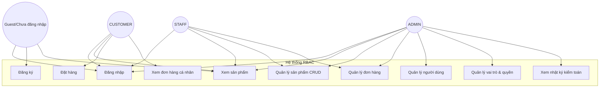
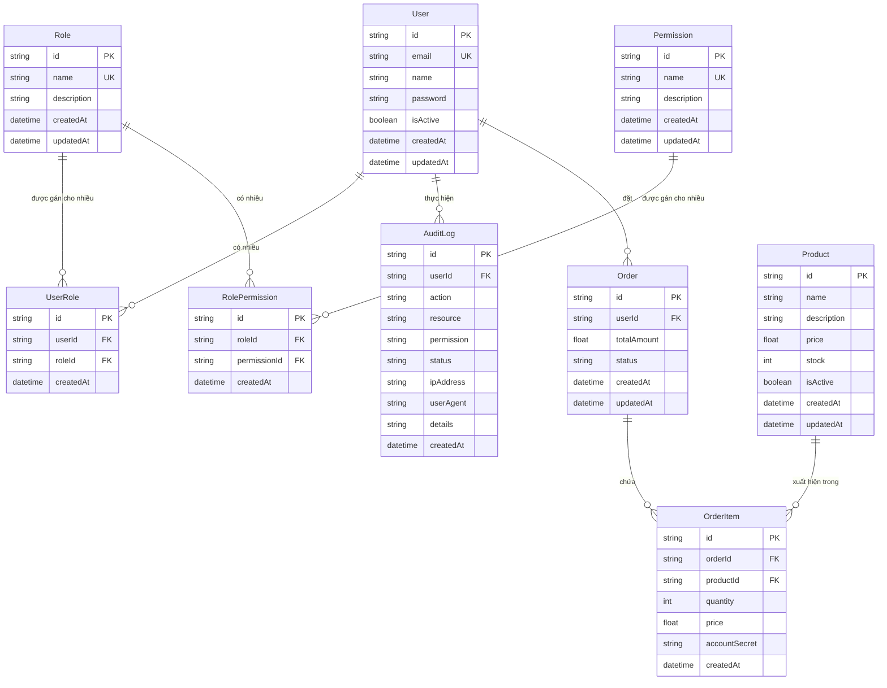
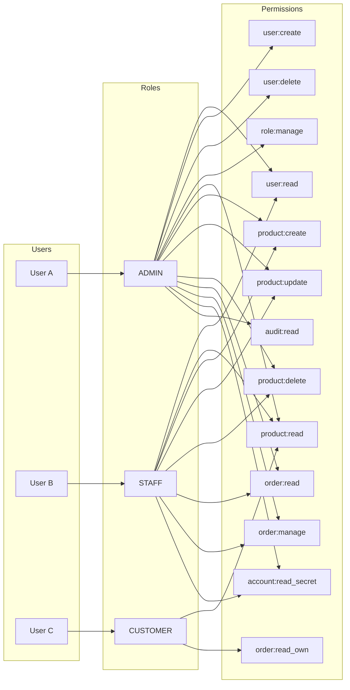
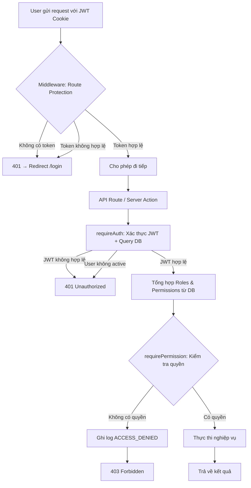
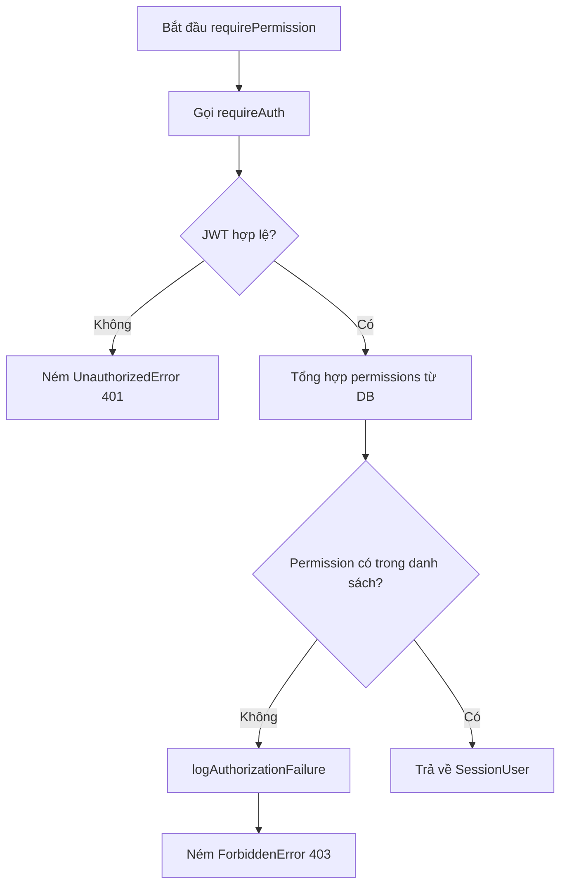
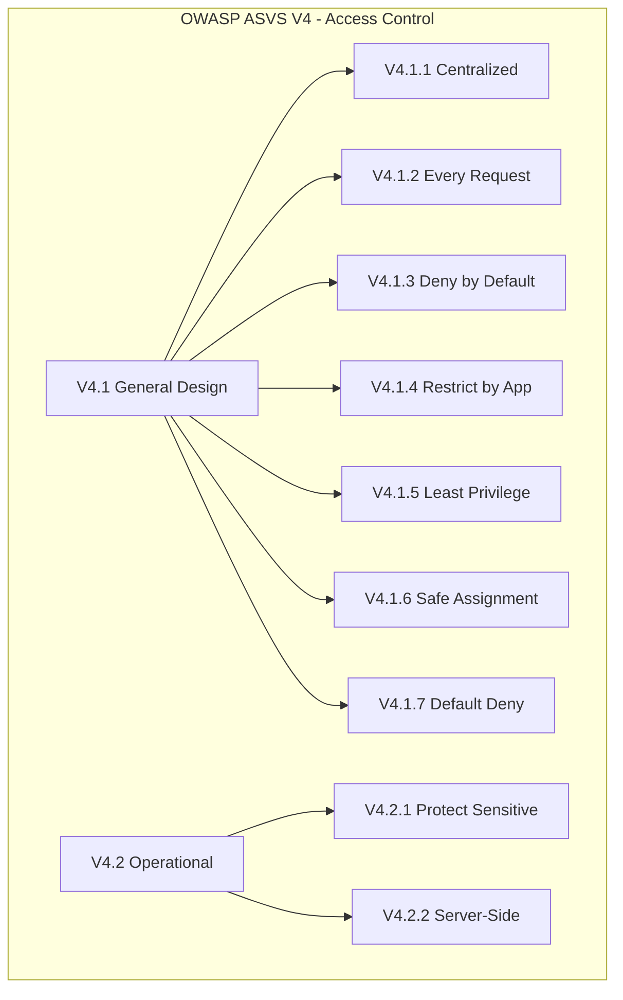
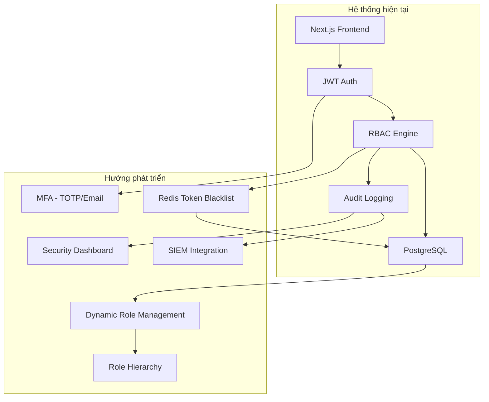

---

**BỘ GIÁO DỤC VÀ ĐÀO TẠO**
**TRƯỜNG ĐẠI HỌC ...**
**KHOA CÔNG NGHỆ THÔNG TIN**
**BỘ MÔN AN TOÀN THÔNG TIN**

---

# BÁO CÁO ĐỒ ÁN MÔN HỌC

---

## XÂY DỰNG HỆ THỐNG PHÂN QUYỀN ROLE-BASED ACCESS CONTROL (RBAC) KẾT HỢP JWT AUTHENTICATION VÀ ĐỐI CHIẾU THEO OWASP ASVS LEVEL 2

---

**Ngành học:** An toàn thông tin

**Giảng viên hướng dẫn:** ...

**Sinh viên thực hiện:** ...

**Mã số sinh viên:** ...

**Lớp:** ...

**Niên khóa:** 2024 – 2025

---

*Thành phố Hồ Chí Minh, 2025*

---

<!-- ==================== TRANG BÌA PHỤ ==================== -->

---

**BỘ GIÁO DỤC VÀ ĐÀO TẠO**
**TRƯỜNG ĐẠI HỌC ...**
**KHOA CÔNG NGHỆ THÔNG TIN**
**BỘ MÔN AN TOÀN THÔNG TIN**

---

# BÁO CÁO ĐỒ ÁN MÔN HỌC

---

## XÂY DỰNG HỆ THỐNG PHÂN QUYỀN ROLE-BASED ACCESS CONTROL (RBAC) KẾT HỢP JWT AUTHENTICATION VÀ ĐỐI CHIẾU THEO OWASP ASVS LEVEL 2

---

**Ngành học:** An toàn thông tin

**Giảng viên hướng dẫn:** ...

**Sinh viên thực hiện:** ...

**Mã số sinh viên:** ...

**Lớp:** ...

**Niên khóa:** 2024 – 2025

---

*Thành phố Hồ Chí Minh, 2025*

---

<!-- ==================== LỜI CẢM ƠN ==================== -->

# LỜI CẢM ƠN

Trong suốt quá trình thực hiện đồ án "Xây dựng hệ thống phân quyền Role-Based Access Control (RBAC) kết hợp JWT Authentication và đối chiếu theo OWASP ASVS Level 2", tôi đã nhận được sự hướng dẫn tận tình, hỗ trợ quý báu từ quý thầy cô, gia đình và bạn bè.

Trước hết, tôi xin gửi lời cảm ơn sâu sắc đến giảng viên hướng dẫn, người đã dành nhiều thời gian và tâm huyết để định hướng, chỉ bảo và góp ý cho tôi trong suốt quá trình nghiên cứu và triển khai. Những nhận xét, góp ý của thầy/cô đã giúp tôi hoàn thiện đề tài một cách tốt nhất.

Tôi cũng xin chân thành cảm ơn quý thầy cô trong Bộ môn An toàn thông tin và Khoa Công nghệ thông tin đã trang bị cho tôi những kiến thức nền tảng vững chắc về bảo mật ứng dụng web, kiểm thử bảo mật và kỹ thuật phần mềm – những kiến thức quý báu đã giúp tôi thực hiện thành công đề tài này.

Xin cảm ơn gia đình và bạn bè đã luôn động viên, hỗ trợ tôi trong suốt thời gian học tập và nghiên cứu.

Do thời gian và kiến thức còn hạn chế, báo cáo khó tránh khỏi những thiếu sót. Tôi rất mong nhận được những ý kiến đóng góp từ quý thầy cô và các bạn để đề tài được hoàn thiện hơn.

**Người thực hiện**

*(Ký và ghi rõ họ tên)*

---

<!-- ==================== LỜI CAM ĐOAN ==================== -->

# LỜI CAM ĐOAN

Tôi cam đoan:

1. Đồ án "Xây dựng hệ thống phân quyền Role-Based Access Control (RBAC) kết hợp JWT Authentication và đối chiếu theo OWASP ASVS Level 2" là công trình nghiên cứu của riêng tôi.

2. Các kết quả, số liệu, mã nguồn và nội dung trình bày trong báo cáo này là trung thực, khách quan và chưa từng được ai công bố trong bất kỳ công trình nào khác.

3. Các tài liệu tham khảo được trích dẫn đầy đủ và chính xác theo đúng quy định.

4. Mã nguồn hệ thống do tôi tự phát triển dựa trên các kiến thức đã học và tài liệu tham khảo, không sao chép từ các nguồn không được phép.

Tôi xin hoàn toàn chịu trách nhiệm trước Hội đồng bảo vệ đồ án và Nhà trường về lời cam đoan này.

**Người thực hiện**

*(Ký và ghi rõ họ tên)*

---

<!-- ==================== DANH MỤC TỪ VIẾT TẮT ==================== -->

# DANH MỤC TỪ VIẾT TẮT

| Viết tắt | Tiếng Anh | Tiếng Việt |
|---|---|---|
| ABAC | Attribute-Based Access Control | Kiểm soát truy cập dựa trên thuộc tính |
| ACL | Access Control List | Danh sách kiểm soát truy cập |
| API | Application Programming Interface | Giao diện lập trình ứng dụng |
| ASVS | Application Security Verification Standard | Tiêu chuẩn kiểm chứng bảo mật ứng dụng |
| CIA | Confidentiality – Integrity – Availability | Bảo mật – Toàn vẹn – Sẵn sàng |
| CUID | Collision-resistant Unique Identifier | Định danh duy nhất chống xung đột |
| DAC | Discretionary Access Control | Kiểm soát truy cập tùy quyền |
| DB | Database | Cơ sở dữ liệu |
| ERD | Entity-Relationship Diagram | Sơ đồ quan hệ thực thể |
| HMAC | Hash-based Message Authentication Code | Mã xác thực thông điệp dựa trên hash |
| HTTP | HyperText Transfer Protocol | Giao thức truyền tải siêu văn bản |
| HTTPS | HyperText Transfer Protocol Secure | Giao thức truyền tải siêu văn bản an toàn |
| IDOR | Insecure Direct Object Reference | Tham chiếu đối tượng trực tiếp không an toàn |
| JWT | JSON Web Token | Token web dạng JSON |
| MAC | Mandatory Access Control | Kiểm soát truy cập bắt buộc |
| MFA | Multi-Factor Authentication | Xác thực đa yếu tố |
| Mermaid | - | Công cụ vẽ sơ đồ dạng văn bản |
| ORM | Object-Relational Mapping | Ánh xạ đối tượng-quan hệ |
| OTP | One-Time Password | Mật khẩu một lần |
| OWASP | Open Worldwide Application Security Project | Tổ chức mã nguồn mở về bảo mật ứng dụng |
| RBAC | Role-Based Access Control | Kiểm soát truy cập dựa trên vai trò |
| REST | Representational State Transfer | Chuyển giao trạng thái biểu diễn |
| RFC | Request for Comments | Yêu cầu bình luận (tiêu chuẩn IETF) |
| SIEM | Security Information and Event Management | Quản lý sự kiện và thông tin bảo mật |
| SQL | Structured Query Language | Ngôn ngữ truy vấn cấu trúc |
| SSO | Single Sign-On | Đăng nhập một lần |
| TAC | Task-Based Access Control | Kiểm soát truy cập dựa trên tác vụ |
| TOTP | Time-based One-Time Password | Mật khẩu một lần dựa trên thời gian |
| UI | User Interface | Giao diện người dùng |
| UX | User Experience | Trải nghiệm người dùng |
| XSS | Cross-Site Scripting | Tấn công chéo trang |

---

<!-- ==================== DANH MỤC BẢNG BIỂU ==================== -->

# DANH MỤC BẢNG BIỂU

Bảng 2.1: So sánh Authentication và Authorization

Bảng 2.2: So sánh các mô hình kiểm soát truy cập

Bảng 3.1: Yêu cầu chức năng của hệ thống

Bảng 3.2: Yêu cầu phi chức năng liên quan đến bảo mật

Bảng 3.3: Cấu trúc bảng Users

Bảng 3.4: Cấu trúc bảng Roles

Bảng 3.5: Cấu trúc bảng Permissions

Bảng 3.6: Cấu trúc bảng UserRoles

Bảng 3.7: Cấu trúc bảng RolePermissions

Bảng 3.8: Cấu trúc bảng AuditLogs

Bảng 3.9: Ma trận phân quyền RBAC

Bảng 4.1: Các loại Audit Action

Bảng 4.2: Tổng kết kết quả kiểm thử

Bảng 5.1: Bảng đối chiếu OWASP ASVS Level 2 – V4 Access Control

Bảng 6.1: Tổng kết mục tiêu đề tài

Bảng 6.2: Đánh giá mức độ tuân thủ OWASP ASVS Level 2

Bảng 6.3: Các hạn chế và mức độ ảnh hưởng

Bảng 6.4: Lộ trình phát triển đề xuất

---

<!-- ==================== DANH MỤC HÌNH VẼ ==================== -->

# DANH MỤC HÌNH VẼ

Sơ đồ 2.1: Quy trình xác thực JWT (Mermaid Sequence Diagram)

Sơ đồ 3.1: Use Case Diagram (Mermaid Graph)

Sơ đồ 3.2: Kiến trúc phân tầng hệ thống (ASCII Diagram)

Sơ đồ 3.3: Entity-Relationship Diagram (Mermaid ER Diagram)

Sơ đồ 3.4: Mô hình RBAC User → Role → Permission (Mermaid Graph)

Sơ đồ 3.5: Luồng Authorization hoàn chỉnh (Mermaid Flowchart)

Sơ đồ 4.1: Luồng xử lý requirePermission() (Mermaid Flowchart)

Sơ đồ 4.2: Kiến trúc Audit Logging (ASCII Diagram)

Sơ đồ 5.1: Mối quan hệ giữa các yêu cầu ASVS V4 (Mermaid Graph)

Sơ đồ 6.1: Kiến trúc hệ thống mở rộng (Mermaid Graph)

---

<!-- ==================== MỤC LỤC ==================== -->

# MỤC LỤC

- [CHƯƠNG 1: GIỚI THIỆU ĐỀ TÀI](#chương-1-giới-thiệu-đề-tài)
  - 1.1 Đặt vấn đề
  - 1.2 Lý do chọn đề tài
  - 1.3 Mục tiêu nghiên cứu
  - 1.4 Phạm vi nghiên cứu
  - 1.5 Phương pháp nghiên cứu
  - 1.6 Cấu trúc báo cáo
  - Nhận xét cuối chương 1
- [CHƯƠNG 2: CƠ SỞ LÝ THUYẾT](#chương-2-cơ-sở-lý-thuyết)
  - 2.1 Authentication và Authorization
  - 2.2 JWT Authentication
  - 2.3 Các mô hình kiểm soát truy cập
  - 2.4 So sánh DAC, MAC, RBAC, ABAC và TAC
  - 2.5 Lý do lựa chọn RBAC
  - 2.6 OWASP ASVS Level 2
  - Nhận xét cuối chương 2
- [CHƯƠNG 3: PHÂN TÍCH VÀ THIẾT KẾ HỆ THỐNG](#chương-3-phân-tích-và-thiết-kế-hệ-thống)
  - 3.1 Yêu cầu hệ thống
  - 3.2 Use Case Diagram
  - 3.3 Kiến trúc hệ thống
  - 3.4 Thiết kế cơ sở dữ liệu
  - 3.5 ERD (Entity-Relationship Diagram)
  - 3.6 Thiết kế RBAC
  - 3.7 Authorization Flow
  - 3.8 Ma trận phân quyền
  - Nhận xét cuối chương 3
- [CHƯƠNG 4: TRIỂN KHAI VÀ KIỂM THỬ](#chương-4-triển-khai-và-kiểm-thử)
  - 4.1 Triển khai JWT Authentication
  - 4.2 Triển khai Middleware Authorization
  - 4.3 Triển khai RBAC
  - 4.4 Phân tích hàm requirePermission()
  - 4.5 Audit Logging
  - 4.6 Kiểm thử hệ thống
  - Nhận xét cuối chương 4
- [CHƯƠNG 5: ĐỐI CHIẾU OWASP ASVS LEVEL 2](#chương-5-đối-chiếu-owasp-asvs-level-2)
  - 5.1 Tổng quan
  - 5.2 V4.1 – Centralized Access Control
  - 5.3 V4.2 – Protect Sensitive Data
  - 5.4 Bảng đối chiếu ASVS
  - 5.5 Đánh giá tổng thể
  - Nhận xét cuối chương 5
- [CHƯƠNG 6: KẾT LUẬN VÀ HƯỚNG PHÁT TRIỂN](#chương-6-kết-luận-và-hướng-phát-triển)
  - 6.1 Kết luận
  - 6.2 Hạn chế
  - 6.3 Hướng phát triển
  - Nhận xét cuối chương 6
- [TÀI LIỆU THAM KHẢO](#tài-liệu-tham-khảo)
- [PHỤ LỤC](#phụ-lục)

---

<!-- ==================== CHƯƠNG 1 ==================== -->

# CHƯƠNG 1: GIỚI THIỆU ĐỀ TÀI

**Mở đầu chương 1:**

Chương mở đầu giới thiệu tổng quan về đề tài nghiên cứu, bao gồm bối cảnh, lý do, mục tiêu, phạm vi và phương pháp nghiên cứu. Nội dung chương làm rõ tính cấp thiết của việc xây dựng hệ thống phân quyền Role-Based Access Control (RBAC) kết hợp JWT Authentication và đối chiếu theo tiêu chuẩn OWASP ASVS Level 2 trong bối cảnh an ninh mạng hiện nay.

## 1.1 Đặt vấn đề

Trong bối cảnh chuyển đổi số diễn ra mạnh mẽ trên toàn thế giới, các hệ thống thông tin ngày càng trở thành mục tiêu tấn công hàng đầu của tội phạm mạng. Theo báo cáo OWASP Top 10 (2021), lỗ hổng **Broken Access Control** (Vi phạm kiểm soát truy cập) đứng ở vị trí đầu tiên trong danh sách các rủi ro bảo mật ứng dụng web, chiếm tỷ lệ 94.55% trong các ứng dụng được kiểm tra [1]. Đây là vấn đề nghiêm trọng, đòi hỏi các tổ chức phải triển khai các cơ chế kiểm soát truy cập chặt chẽ, khoa học và tuân thủ các tiêu chuẩn bảo mật quốc tế.

Kiểm soát truy cập (Access Control) là một trong những trụ cột cốt lõi của bảo mật thông tin. Theo mô hình CIA (Confidentiality – Integrity – Availability), kiểm soát truy cập trực tiếp bảo vệ tính bảo mật (Confidentiality) bằng cách đảm bảo chỉ những người dùng được ủy quyền mới có thể truy cập tài nguyên và thực hiện các thao tác nhất định. Khi hệ thống phân quyền hoạt động không chính xác, hậu quả có thể rất nghiêm trọng:

- **Tiết lộ dữ liệu nhạy cảm:** Kẻ tấn công có thể truy cập dữ liệu cá nhân, thông tin tài chính hoặc bí mật thương mại của người dùng khác.
- **Thay đổi trái phép dữ liệu:** Việc thiếu kiểm soát quyền ghi (write permission) có thể dẫn đến sửa đổi hoặc xóa dữ liệu quan trọng.
- **Leo thang đặc quyền (Privilege Escalation):** Một người dùng thông thường có thể chiếm quyền quản trị viên, kiểm soát toàn bộ hệ thống.
- **Mất mát tài nguyên:** Hệ thống bị lợi dụng để tiêu tốn tài nguyên, gây từ chối dịch vụ (Denial of Service).

Các cuộc tấn công liên quan đến Broken Access Control trong những năm gần đây ngày càng tinh vi và phổ biến. Năm 2023, một lỗ hổng IDOR (Insecure Direct Object Reference) trong hệ thống của Uber đã cho phép kẻ tấn công truy cập dữ liệu nội bộ thông qua việc giả mạo request. Microsoft cũng từng ghi nhận một lỗ hổng privilege escalation cho phép người dùng thông thường nâng cấp thành quản trị viên toàn cầu. Tại Việt Nam, nhiều hệ thống thương mại điện tử và ngân hàng trực tuyến cũng từng bị ảnh hưởng bởi các lỗ hổng tương tự, gây mất mát dữ liệu và uy tín doanh nghiệp.

Trước thực trạng trên, việc xây dựng một hệ thống phân quyền robust (kiên cố), có thể kiểm chứng và tuân thủ các tiêu chuẩn quốc tế là vô cùng cấp thiết. Đề tài này hướng tới việc xây dựng hệ thống phân quyền Role-Based Access Control (RBAC) kết hợp với JWT Authentication, đồng thời đối chiếu tuân thủ theo OWASP Application Security Verification Standard (ASVS) Level 2 – một tiêu chuẩn kiểm chứng bảo mật được công nhận rộng rãi trong ngành phát triển ứng dụng web an toàn.

## 1.2 Lý do chọn đề tài

Lý do lựa chọn đề tài được xác định dựa trên bốn yếu tố chính:

**Thứ nhất, tính cấp thiết về thực tiễn.** Broken Access Control liên tục đứng đầu OWASP Top 10 trong nhiều năm liền. Việc triển khai một hệ thống RBAC chuẩn hóa, có kiểm chứng theo ASVS Level 2 giúp giải quyết trực tiếp lỗ hổng nghiêm trọng nhất trong phát triển ứng dụng web hiện nay.

**Thứ hai, giá trị học thuật.** Đề tài kết hợp giữa lý thuyết kiểm soát truy cập (RBAC, least privilege, defense in depth) với triển khai thực tế trên công nghệ hiện đại (Next.js, TypeScript, JWT, Prisma ORM). Việc đối chiếu theo OWASP ASVS Level 2 đảm bảo hệ thống không chỉ hoạt động đúng mà còn được kiểm chứng theo tiêu chuẩn quốc tế.

**Thứ ba, khả năng ứng dụng rộng rãi.** Hệ thống RBAC được xây dựng trong đồ án có thể áp dụng cho hầu hết các ứng dụng web cần phân quyền đa cấp, từ hệ thống quản trị nội bộ (admin dashboard), nền tảng thương mại điện tử, đến các ứng dụng SaaS (Software as a Service).

**Thứ tư, phù hợp với hướng nghiên cứu ngành An toàn thông tin.** Đề tài nằm trong lĩnh vực ứng dụng bảo mật (Application Security), một trong các hướng nghiên cứu trọng điểm của ngành An toàn thông tin, đòi hỏi kiến thức chuyên sâu về cả phát triển phần mềm và kiểm thử bảo mật.

## 1.3 Mục tiêu nghiên cứu

Đề tài đặt ra năm mục tiêu nghiên cứu cụ thể sau:

1. **Nghiên cứu lý thuyết** về các mô hình kiểm soát truy cập (DAC, MAC, RBAC, ABAC, TAC), xác thực JWT và tiêu chuẩn OWASP ASVS Level 2.
2. **Phân tích và thiết kế** hệ thống phân quyền RBAC theo mô hình User → Role → Permission, tích hợp với cơ chế xác thực JWT trên nền tảng Next.js.
3. **Triển khai** hệ thống RBAC với ba vai trò (ADMIN, STAFF, CUSTOMER), bao gồm middleware xác thực, hàm kiểm tra quyền tập trung và hệ thống audit logging.
4. **Kiểm thử** hệ thống thông qua các tình huống kiểm thử thực tế, xác nhận tính đúng đắn của cơ chế phân quyền.
5. **Đối chiếu** hệ thống triển khai với các yêu cầu OWASP ASVS Level 2, đánh giá mức độ tuân thủ và xác định các điểm cần cải thiện.

## 1.4 Phạm vi nghiên cứu

Phạm vi nghiên cứu của đề tài được xác định trên ba khía cạnh:

- **Phạm vi kỹ thuật:** Hệ thống được xây dựng trên nền tảng Next.js (React framework) với TypeScript, sử dụng PostgreSQL làm hệ quản trị cơ sở dữ liệu, Prisma ORM làm lớp truy xuất dữ liệu, và JWT (JSON Web Token) làm cơ chế xác thực.
- **Phạm vi chức năng:** Hệ thống triển khai phân quyền theo mô hình RBAC với ba vai trò chính (ADMIN, STAFF, CUSTOMER), bao gồm quản lý người dùng, quản lý vai trò, quản lý sản phẩm, quản lý đơn hàng và nhật ký kiểm toán (audit log).
- **Phạm vi bảo mật:** Đối chiếu với OWASP ASVS Level 2, tập trung vào các yêu cầu thuộc V4 – Access Control.

**Giới hạn:** Đề tài không bao gồm triển khai Multi-Factor Authentication (MFA), Single Sign-On (SSO), hay tích hợp hệ thống SIEM. Hệ thống hiện tại sử dụng JWT symmetric key (HS256) thay vì asymmetric key (RS256). Các vai trò (roles) được định nghĩa cố định trong mã nguồn, chưa có giao diện quản lý role động.

## 1.5 Phương pháp nghiên cứu

Đề tài sử dụng kết hợp bốn phương pháp nghiên cứu:

1. **Nghiên cứu tài liệu (Literature Review):** Tổng hợp và phân tích các tài liệu khoa học, tiêu chuẩn OWASP (ASVS 4.0, Top 10), các ấn phẩm nghiên cứu về RBAC và JWT Authentication.
2. **Nghiên cứu phân tích (Analytical Research):** Phân tích yêu cầu phi chức năng về bảo mật, thiết kế kiến trúc hệ thống phân quyền và đánh giá khả năng đáp ứng các yêu cầu ASVS Level 2.
3. **Nghiên cứu thực nghiệm (Experimental Research):** Triển khai hệ thống trên môi trường thực tế, thực hiện kiểm thử chức năng và kiểm thử bảo mật, thu thập kết quả để đánh giá hiệu quả.
4. **Phương pháp đối chiếu (Benchmarking):** Đối chiếu từng yêu cầu của OWASP ASVS Level 2 với cách thức triển khai thực tế trong hệ thống.

## 1.6 Cấu trúc báo cáo

Báo cáo được tổ chức thành 6 chương, cùng với phần tài liệu tham khảo và phụ lục:

- **Chương 1 – Giới thiệu đề tài:** Trình bày bối cảnh, lý do, mục tiêu, phạm vi và phương pháp nghiên cứu.
- **Chương 2 – Cơ sở lý thuyết:** Trình bày các kiến thức nền tảng về Authentication, Authorization, JWT, các mô hình kiểm soát truy cập và OWASP ASVS.
- **Chương 3 – Phân tích và thiết kế hệ thống:** Phân tích yêu cầu, thiết kế kiến trúc, mô hình dữ liệu và luồng phân quyền.
- **Chương 4 – Triển khai và kiểm thử:** Chi tiết triển khai JWT, RBAC, audit logging, phân tích mã nguồn và kết quả kiểm thử.
- **Chương 5 – Đối chiếu OWASP ASVS Level 2:** Phân tích chi tiết từng yêu cầu V4 Access Control và mức độ tuân thủ.
- **Chương 6 – Kết luận và hướng phát triển:** Tổng kết kết quả, hạn chế và đề xuất cải thiện.
- **Tài liệu tham khảo:** Danh sách các tài liệu, tiêu chuẩn và nguồn tham khảo.
- **Phụ lục:** Các thông tin bổ sung về tài khoản demo, danh sách quyền và cấu trúc thư mục.

**Nhận xét cuối chương 1:**

Chương 1 đã giới thiệu toàn diện bối cảnh, lý do và mục tiêu của đề tài. Việc Broken Access Control đứng đầu OWASP Top 10 trong nhiều năm liền là cơ sở vững chắc cho sự cần thiết của đề tài. Năm mục tiêu nghiên cứu được xác định rõ ràng, bao quát từ nghiên cứu lý thuyết đến triển khai thực nghiệm và đối chiếu tiêu chuẩn. Phạm vi nghiên cứu được giới hạn hợp lý, tập trung vào RBAC kết hợp JWT và đối chiếu ASVS Level 2, đảm bảo tính khả thi và khả năng hoàn thành trong khuôn khổ đồ án môn học.

---

<!-- ==================== CHƯƠNG 2 ==================== -->

# CHƯƠNG 2: CƠ SỞ LÝ THUYẾT

**Mở đầu chương 2:**

Chương 2 trình bày các kiến thức lý thuyết nền tảng cần thiết cho đề tài. Các nội dung bao gồm: khái niệm và sự khác biệt giữa Authentication và Authorization, cơ chế hoạt động của JWT, tổng quan và so sánh các mô hình kiểm soát truy cập (DAC, MAC, RBAC, ABAC, TAC), lý do lựa chọn RBAC, và giới thiệu về tiêu chuẩn OWASP ASVS Level 2.

## 2.1 Authentication và Authorization

### 2.1.1 Khái niệm Authentication (Xác thực)

Authentication (Xác thực) là quá trình xác minh danh tính của một thực thể (người dùng, thiết bị hoặc ứng dụng) trong hệ thống. Mục tiêu của Authentication là trả lời câu hỏi: *"Bạn là ai?"* [2].

Trong phát triển ứng dụng web, có ba phương thức xác thực chính dựa trên ba yếu tố (factors):

- **Something you know (Yếu tố kiến thức):** Thông tin chỉ người dùng biết, như mật khẩu, mã PIN, câu hỏi bí mật.
- **Something you have (Yếu tố sở hữu):** Vật thể vật lý mà người dùng sở hữu, như token phần cứng (YubiKey), điện thoại di động (OTP SMS).
- **Something you are (Yếu tố sinh trắc):** Đặc điểm sinh học của người dùng, như vân tay, khuôn mặt, mống mắt.

Hệ thống trong đề tài này sử dụng phương thức **something you know** (mật khẩu) kết hợp với **something you have** (JWT token lưu trong cookie httpOnly) để xác thực.

### 2.1.2 Khái niệm Authorization (Phân quyền)

Authorization (Phân quyền) là quá trình xác định quyền hạn của một thực thể đã được xác thực. Mục tiêu của Authorization là trả lời câu hỏi: *"Bạn có thể làm gì?"* [2].

Authorization diễn ra **sau** quá trình Authentication. Hệ thống cần biết người dùng là ai (Authentication) trước khi quyết định người dùng đó có quyền truy cập tài nguyên nào (Authorization).

### 2.1.3 So sánh Authentication và Authorization

Bảng 2.1: So sánh Authentication và Authorization

| Tiêu chí | Authentication (Xác thực) | Authorization (Phân quyền) |
|---|---|---|
| **Mục đích** | Xác minh danh tính | Cấp quyền truy cập |
| **Câu hỏi** | "Bạn là ai?" | "Bạn có thể làm gì?" |
| **Thứ tự** | Diễn ra trước | Diễn ra sau Authentication |
| **Đầu ra** | Danh tính người dùng (userId, email) | Quyền hạn (permissions, roles) |
| **Phương thức** | Mật khẩu, token, sinh trắc học | RBAC, ACL, Policy |
| **Ví dụ** | Đăng nhập bằng email/mật khẩu | Kiểm tra user có quyền xóa bài viết không |
| **Tác nhân thực thi** | Authentication middleware | Authorization middleware / RBAC Engine |
| **Khi thất bại** | Yêu cầu đăng nhập lại (401 Unauthorized) | Từ chối truy cập (403 Forbidden) |

Trong hệ thống được triển khai, Authentication sử dụng JWT (JSON Web Token) và Authorization sử dụng mô hình RBAC với hàm `requirePermission()` tập trung. Hai quá trình này được tách biệt rõ ràng trong kiến trúc hệ thống, đảm bảo nguyên tắc Separation of Concerns.

## 2.2 JWT Authentication

### 2.2.1 JWT là gì

JWT (JSON Web Token) là một tiêu chuẩn mở (RFC 7519) được sử dụng để truyền thông tin an toàn giữa hai bên dưới dạng JSON Object được mã hóa và ký số [3]. JWT thường được sử dụng trong cơ chế xác thực Stateless, trong đó server không cần lưu trạng thái session mà tất cả thông tin cần thiết đều được mã hóa trong token itself.

### 2.2.2 Cấu trúc JWT

Một JWT token bao gồm ba phần, được phân tách bằng dấu chấm (`.`):

```
eyJhbGciOiJIUzI1NiJ9.eyJ1c2VySWQiOiIxMjM0NTYiLCJlbWFpbCI6InVzZXJAZ21haWwuY29tIn0.signature
```

**Phần 1: Header (Tiêu đề)**

Chứa thông tin về thuật toán mã hóa và loại token:

```json
{
  "alg": "HS256",
  "typ": "JWT"
}
```

- `alg`: Thuật toán ký số (algorithm). Hệ thống sử dụng HS256 (HMAC-SHA256).
- `typ`: Loại token, ở đây là JWT.

**Phần 2: Payload (Tải)**

Chứa các claim (thông tin) về người dùng. Trong hệ thống triển khai, payload chứa:

```json
{
  "userId": "clxyz123456",
  "email": "user@gmail.com",
  "iat": 1700000000,
  "exp": 1700604800
}
```

- `userId`: Mã định danh duy nhất của người dùng.
- `email`: Địa chỉ email của người dùng.
- `iat` (Issued At): Thời điểm token được tạo.
- `exp` (Expiration): Thời điểm token hết hạn (7 ngày trong hệ thống).

**Phần 3: Signature (Chữ ký)**

Được tạo bằng cách mã hóa Base64Url của header và payload cùng với secret key:

```
HMACSHA256(
  base64UrlEncode(header) + "." + base64UrlEncode(payload),
  secret_key
)
```

Signature đảm bảo tính toàn vẹn (integrity) của token – mọi thay đổi đối với header hoặc payload đều khiến signature không còn hợp lệ.

### 2.2.3 Quy trình hoạt động JWT

Sơ đồ 2.1: Quy trình xác thực JWT (Mermaid Sequence Diagram)

```mermaid
sequenceDiagram
    participant U as User (Browser)
    participant S as Server (Next.js)
    participant DB as Database (PostgreSQL)

    U->>S: POST /api/auth/login {email, password}
    S->>DB: SELECT user WHERE email = ?
    DB-->>S: User data (hashed password, roles, permissions)
    S->>S: comparePassword(password, hashedPassword)
    alt Mật khẩu đúng
        S->>S: signToken({userId, email}) → JWT Token
        S-->>Set-Cookie: auth-token=<JWT>; httpOnly; secure
        S-->>U: 200 OK {user info, redirectTo}
    else Mật khẩu sai
        S->>S: logLogin(userId, false)
        S-->>U: 401 Unauthorized
    end

    Note over U,S: --- Mỗi request sau đó ---

    U->>S: GET /admin/users (Cookie: auth-token=<JWT>)
    S->>S: verifyToken(JWT) → payload
    S->>DB: SELECT user + roles + permissions
    DB-->>S: User with roles & permissions
    S->>S: requirePermission('user:read')
    alt Có quyền
        S-->>U: 200 OK (dữ liệu)
    else Không có quyền
        S->>S: logAuthorizationFailure()
        S-->>U: 403 Forbidden
    end
```

Trong hệ thống triển khai, quy trình hoạt động chi tiết như sau:

1. **Bước 1 – Đăng nhập:** User gửi yêu cầu POST `/api/auth/login` với email và mật khẩu. Server kiểm tra email tồn tại, so sánh mật khẩu bằng bcrypt (qua hàm `comparePassword()`), tổng hợp roles và permissions từ cơ sở dữ liệu.

2. **Bước 2 – Tạo JWT:** Nếu xác thực thành công, server gọi hàm `signToken()` để tạo JWT token chứa `userId` và `email`, với thời hạn 7 ngày, thuật toán HS256, ký bằng secret key lấy từ biến môi trường `JWT_SECRET`.

3. **Bước 3 – Gửi Cookie:** Token được đặt vào cookie `auth-token` với các thuộc tính bảo mật: `httpOnly: true` (không thể truy cập qua JavaScript), `secure: true` (chỉ gửi qua HTTPS ở production), `sameSite: 'lax'`, `path: '/'`, `maxAge: 604800` (7 ngày).

4. **Bước 4 – Xác thực mỗi request:** Tại Middleware (Edge Runtime), token được trích xuất từ cookie và xác thực bằng `verifyTokenEdge()` sử dụng thư viện `jose` (tương thích Edge). Tại Server-side (API routes / Server Actions), token được xác thực bằng `verifyToken()` sử dụng thư viện `jsonwebtoken`.

5. **Bước 5 – Kiểm tra quyền:** Sau khi xác thực JWT thành công, hệ thống truy vấn database để lấy danh sách roles và permissions của user, sau đó kiểm tra quyền cụ thể bằng hàm `requirePermission()`.

### 2.2.4 Ưu điểm của JWT trong hệ thống

- **Stateless:** Server không cần lưu session state, giúp mở rộng (scale) dễ dàng theo chiều ngang.
- **Hiệu suất:** Verify token không cần truy vấn database nhiều lần (token đã chứa thông tin cơ bản).
- **Cross-domain:** JWT có thể sử dụng trên nhiều domain, phù hợp kiến trúc microservice.
- **Tương thích Edge Runtime:** Sử dụng thư viện `jose` cho middleware ở Edge Runtime của Next.js.
- **Bảo mật cookie:** Token được lưu trong cookie httpOnly, ngăn chặn tấn công XSS đánh cắp token.

### 2.2.5 Nhược điểm của JWT và biện pháp giảm thiểu

- **Không thể thu hồi trước hạn:** Do tính Stateless, token vẫn hợp lệ cho đến khi hết hạn. *Biện pháp:* Hạn chế thời gian sống của token (7 ngày), đề xuất triển khai token blacklist trong hướng phát triển.
- **Kích thước token:** JWT chứa đầy đủ thông tin, kích thước lớn hơn Session ID thông thường. *Biện pháp:* Payload tối thiểu, chỉ chứa userId và email (không chứa roles/permissions).
- **Rủi ro nếu bị đánh cắp:** Token có thể bị lợi dụng trong khoảng thời gian trước khi hết hạn. *Biện pháp:* Cookie httpOnly + secure + sameSite giảm thiểu rủi ro XSS, CSRF; luôn sử dụng HTTPS.

## 2.3 Các mô hình kiểm soát truy cập

### 2.3.1 DAC – Discretionary Access Control

DAC (Discretionary Access Control – Kiểm soát truy cập tùy quyền) là mô hình trong đó chủ sở hữu tài nguyên có quyền quyết định ai được truy cập tài nguyên đó. Chủ sở hữu có thể cấp hoặc thu hồi quyền truy cập theo ý muốn [4].

**Đặc điểm:**
- Chủ sở hữu tài nguyên toàn quyền quyết định.
- Linh hoạt, dễ sử dụng.
- Phù hợp cho môi trường cá nhân, nhóm nhỏ.

**Hạn chế:**
- Khó quản lý quy mô lớn.
- Không đảm bảo chính sách bảo mật tập trung.
- Rủi ro vi phạm nguyên tắc least privilege vì chủ sở hữu có thể gán quyền quá rộng.

**Ví dụ:** Hệ thống file trên Windows, Linux – chủ sở hữu file có thể cấp quyền đọc/ghi cho người dùng khác.

### 2.3.2 MAC – Mandatory Access Control

MAC (Mandatory Access Control – Kiểm soát truy cập bắt buộc) là mô hình trong đó quyền truy cập được quyết định bởi hệ thống dựa trên các nhãn bảo mật (security labels) được gán cho đối tượng và chủ thể. Người dùng không thể tự ý thay đổi quyền truy cập [4].

**Đặc điểm:**
- Quản lý tập trung bởi quản trị hệ thống.
- Phù hợp cho môi trường quân sự, chính phủ.
- Bảo mật cao, tuân thủ chính sách bắt buộc.

**Hạn chế:**
- Cứng nhắc, khó cấu hình.
- Không linh hoạt cho ứng dụng web thương mại.
- Chi phí triển khai và duy trì cao.

**Ví dụ:** Hệ thống SELinux trên Linux, hệ thống MILS (Multiple Independent Levels of Security).

### 2.3.3 RBAC – Role-Based Access Control

RBAC (Role-Based Access Control – Kiểm soát truy cập dựa trên vai trò) là mô hình trong đó quyền truy cập được phân phối thông qua vai trò (role). Người dùng được gán vai trò, và mỗi vai trò được gán một tập hợp các quyền (permissions) nhất định [5].

**Đặc điểm:**
- Tách biệt người dùng và quyền thông qua vai trò trung gian.
- Dễ quản lý, dễ mở rộng.
- Tuân thủ nguyên tắc Least Privilege và Separation of Duty.
- Phù hợp cho ứng dụng web, hệ thống doanh nghiệp.

**Hạn chế:**
- Có thể phát sinh "role explosion" nếu số lượng vai trò quá lớn.
- Khó quản lý phân quyền fine-grained trong một số trường hợp phức tạp.

**Ví dụ:** Hệ thống phân quyền trong WordPress, Joomla, các ứng dụng doanh nghiệp.

### 2.3.4 ABAC – Attribute-Based Access Control

ABAC (Attribute-Based Access Control – Kiểm soát truy cập dựa trên thuộc tính) là mô hình trong đó quyết định truy cập dựa trên các thuộc tính (attributes) của chủ thể, đối tượng, hành động và điều kiện môi trường [6].

**Đặc điểm:**
- Rất linh hoạt, có thể biểu diễn các chính sách phức tạp.
- Dựa trên thuộc tính: role, phòng ban, thời gian, vị trí, thiết bị.
- Phù hợp cho môi trường có chính sách phức tạp.

**Hạn chế:**
- Phức tạp trong thiết kế và triển khai.
- Khó kiểm chứng và auditing.
- Hiệu năng thấp hơn RBAC do cần evaluate nhiều thuộc tính.

**Ví dụ:** Hệ thống AWS IAM, Google Cloud IAM.

### 2.3.5 TAC – Task-Based Access Control

TAC (Task-Based Access Control – Kiểm soát truy cập dựa trên tác vụ) là mô hình trong đó quyền truy cập được gán dựa trên tác vụ (task) mà người dùng cần thực hiện, thay vì dựa trên vai trò cố định [7].

**Đặc điểm:**
- Tập trung vào tác vụ nghiệp vụ.
- Linh hoạt, phù hợp quy trình công việc thay đổi.
- Có thể kết hợp với RBAC và ABAC.

**Hạn chế:**
- Phức tạp trong việc xác định và quản lý tác vụ.
- Ít được hỗ trợ bởi các framework phổ biến.
- Khó auditing hơn RBAC.

**Ví dụ:** Hệ thống quản lý quy trình trong y tế, quân sự.

## 2.4 So sánh DAC, MAC, RBAC, ABAC và TAC

Bảng 2.2: So sánh các mô hình kiểm soát truy cập

| Tiêu chí | DAC | MAC | RBAC | ABAC | TAC |
|---|---|---|---|---|---|
| **Cơ sở phân quyền** | Chủ sở hữu tài nguyên | Nhãn bảo mật | Vai trò | Thuộc tính | Tác vụ |
| **Tính linh hoạt** | Cao | Thấp | Trung bình | Rất cao | Cao |
| **Dễ quản trị** | Dễ (quy mô nhỏ) | Khó | Dễ | Phức tạp | Trung bình |
| **Khả năng mở rộng** | Thấp | Trung bình | Cao | Rất cao | Trung bình |
| **Độ phức tạp triển khai** | Thấp | Cao | Trung bình | Rất cao | Cao |
| **Mức phù hợp với Web App** | Thấp | Thấp | Rất cao | Trung bình | Thấp |
| **Least Privilege** | Khó đảm bảo | Tự động | Dễ đạt | Đạt được | Dễ đạt |
| **Separation of Duty** | Không hỗ trợ | Hỗ trợ | Hỗ trợ | Hỗ trợ | Hỗ trợ |
| **Khả năng Auditing** | Thấp | Trung bình | Cao | Trung bình | Thấp |
| **Ví dụ** | File system | SELinux | WordPress, RBAC | AWS IAM | Y tế, quân sự |

## 2.5 Lý do lựa chọn RBAC

Từ bảng so sánh trên, RBAC được lựa chọn cho hệ thống triển khai vì các lý do sau:

**Thứ nhất, phù hợp với kiến trúc ứng dụng web doanh nghiệp.** Hệ thống có ba vai trò rõ ràng (ADMIN, STAFF, CUSTOMER), mỗi vai trò có tập quyền xác định. RBAC mô hình hóa chính xác cấu trúc tổ chức này.

**Thứ hai, dễ quản lý và mở rộng.** Khi cần thêm quyền mới (ví dụ: `product:export`), quản trị viên chỉ cần tạo permission mới và gán vào role tương ứng. Không cần thay đổi mã nguồn hay cấu trúc phân quyền.

**Thứ ba, tuân thủ nguyên tắc Least Privilege.** Mỗi role chỉ được gán đúng các quyền cần thiết cho chức năng của nó. CUSTOMER chỉ có `product:read` và `order:read_own`, không có quyền quản trị.

**Thứ tư, hỗ trợ kiểm toán (Auditing).** Vì mỗi quyền gắn với role, và mỗi user gắn với role, việc auditing trở nên dễ dàng: có thể kiểm tra ai có quyền gì thông qua chuỗi User → Role → Permission.

**Thứ năm, hỗ trợ Separation of Duty (Phân chia trách nhiệm).** RBAC cho phép thiết lập chính sách: người tạo dữ liệu không phải là người phê duyệt, giảm thiểu rủi ro gian lận.

**Thứ sáu, tính phổ biến và hỗ trợ cộng đồng.** RBAC được hỗ trợ rộng rãi bởi các framework và thư viện, có nhiều tài liệu tham khảo và best practices.

## 2.6 OWASP ASVS Level 2

### 2.6.1 Tổng quan OWASP

OWASP (Open Worldwide Application Security Project) là tổ chức phi lợi nhuận quốc tế chuyên về cải thiện bảo mật phần mềm. OWASP cung cấp các tài liệu, công cụ và phương pháp luận được sử dụng rộng rãi bởi các chuyên gia bảo mật trên toàn thế giới [8]. Hai ấn phẩm nổi bật nhất của OWASP là OWASP Top 10 (xếp hạng các rủi ro bảo mật phổ biến) và OWASP ASVS (tiêu chuẩn kiểm chứng bảo mật ứng dụng).

### 2.6.2 OWASP ASVS

OWASP Application Security Verification Standard (ASVS) là tiêu chuẩn quốc tế về kiểm chứng bảo mật ứng dụng. ASVS cung cấp khung tham chiếu cho các yêu cầu bảo mật ứng dụng, được tổ chức thành ba cấp độ xác minh (Verification Levels):

- **Level 1 (Associate):** Yêu cầu cơ bản, phù hợp cho mọi ứng dụng. Tự động hóa được, không cần chuyên gia bảo mật.
- **Level 2 (Professional):** Yêu cầu nâng cao, phù hợp cho ứng dụng xử lý dữ liệu quan trọng. Đây là cấp độ mà đồ án hướng tới. Yêu cầu có chuyên gia bảo mật tham gia.
- **Level 3 (Expert):** Yêu cầu nghiêm ngặt nhất, phù hợp cho ứng dụng xử lý dữ liệu nhạy cảm cao (tài chính, y tế, quân sự). Yêu cầu kiểm tra thủ công chuyên sâu.

### 2.6.3 OWASP ASVS V4 – Access Control Requirements

Phần V4 của ASVS tập trung vào các yêu cầu kiểm soát truy cập. Các yêu cầu chính bao gồm:

**V4.1 – General Access Control Design:**
- V4.1.1: Hệ thống kiểm soát truy cập được quản lý tập trung.
- V4.1.2: Mọi truy cập đều phải thông qua cơ chế kiểm soát truy cập tập trung.
- V4.1.3: Nguyên tắc Deny by Default – mặc định từ chối truy cập.
- V4.1.4: Phân quyền theo chức năng ứng dụng.
- V4.1.5: Nguyên tắc Least Privilege – đặc quyền tối thiểu.
- V4.1.6: Gán quyền phải thông qua giao diện an toàn.
- V4.1.7: Chính sách mặc định là từ chối.

**V4.2 – Operational Access Control:**
- V4.2.1: Tài nguyên nhạy cảm được bảo vệ bởi cơ chế kiểm soát truy cập.
- V4.2.2: Kiểm soát truy cập được thực thi trên server-side.

Các yêu cầu V4 được sử dụng làm cơ sở cho Chương 5 – Đối chiếu OWASP ASVS Level 2.

**Nhận xét cuối chương 2:**

Chương 2 đã trình bày đầy đủ các kiến thức lý thuyết nền tảng cần thiết cho đề tài. Việc so sánh năm mô hình kiểm soát truy cập (Bảng 2.2) cho thấy RBAC là lựa chọn phù hợp nhất cho ứng dụng web doanh nghiệp với khả năng dễ quản trị, mở rộng tốt và tuân thủ nguyên tắc Least Privilege. JWT được xác nhận là cơ chế xác thực Stateless hiệu quả, phù hợp với kiến trúc Next.js hiện đại. OWASP ASVS Level 2 cung cấp khung kiểm chứng bảo mật toàn diện để đánh giá hệ thống. Các kiến thức này là cơ sở vững chắc cho các chương tiếp theo.

---

<!-- ==================== CHƯƠNG 3 ==================== -->

# CHƯƠNG 3: PHÂN TÍCH VÀ THIẾT KẾ HỆ THỐNG

**Mở đầu chương 3:**

Chương 3 trình bày quy trình phân tích yêu cầu và thiết kế hệ thống RBAC. Nội dung bao gồm: các yêu cầu chức năng và phi chức năng, use case diagram cho ba vai trò, kiến trúc 7 tầng của hệ thống, thiết kế cơ sở dữ liệu với 7 bảng, ERD, mô hình RBAC User → Role → Permission, luồng authorization hoàn chỉnh và ma trận phân quyền chi tiết.

## 3.1 Yêu cầu hệ thống

### 3.1.1 Yêu cầu chức năng (Functional Requirements)

Bảng 3.1: Yêu cầu chức năng của hệ thống

| Mã yêu cầu | Mô tả | Vai trò liên quan |
|---|---|---|
| FR-01 | Đăng nhập bằng email và mật khẩu, nhận JWT token | Tất cả |
| FR-02 | Đăng ký tài khoản mới | Guest |
| FR-03 | Quản lý người dùng (xem, tạo, cập nhật, xóa) | ADMIN |
| FR-04 | Quản lý vai trò và quyền | ADMIN |
| FR-05 | Xem danh sách sản phẩm | Tất cả |
| FR-06 | CRUD sản phẩm | ADMIN, STAFF |
| FR-07 | Quản lý đơn hàng | ADMIN, STAFF |
| FR-08 | Xem đơn hàng của bản thân | CUSTOMER |
| FR-09 | Xem nhật ký kiểm toán | ADMIN |
| FR-10 | Phân quyền chi tiết theo từng hành động | Hệ thống |

### 3.1.2 Yêu cầu phi chức năng (Non-Functional Requirements)

Bảng 3.2: Yêu cầu phi chức năng liên quan đến bảo mật

| Mã yêu cầu | Mô tả | Tiêu chuẩn tham chiếu |
|---|---|---|
| NFR-01 | JWT token phải được lưu trong cookie httpOnly | OWASP ASVS V3.4 |
| NFR-02 | Mọi request phải được kiểm tra quyền server-side | OWASP ASVS V4.1 |
| NFR-03 | Hệ thống mặc định từ chối truy cập khi không có quyền | Deny by Default |
| NFR-04 | Mọi hành động truy cập phải được ghi log | OWASP ASVS V7.1 |
| NFR-05 | Mật khẩu phải được hash bằng bcrypt | OWASP ASVS V2.4 |
| NFR-06 | JWT phải sử dụng thuật toán HS256 và secret mạnh | OWASP ASVS V3.5 |

## 3.2 Use Case Diagram

Sơ đồ Use Case mô tả các tương tác của bốn tác nhân (ADMIN, STAFF, CUSTOMER, GUEST) với hệ thống.

Sơ đồ 3.1: Use Case Diagram (Mermaid)



**Mô tả các Use Case chính:**

- **Đăng nhập (UC1):** Tất cả người dùng đều có thể thực hiện. Kiểm tra email/mật khẩu, trả về JWT token.
- **Quản lý người dùng (UC8):** Chỉ ADMIN có quyền xem danh sách, tạo, cập nhật, vô hiệu hóa người dùng.
- **Quản lý vai trò & quyền (UC9):** Chỉ ADMIN có quyền gán/bỏ role cho user, cập nhật quyền cho role.
- **Quản lý sản phẩm CRUD (UC6):** ADMIN và STAFF có quyền tạo, cập nhật, xóa sản phẩm.
- **Xem đơn hàng cá nhân (UC5):** CUSTOMER chỉ xem được đơn hàng của chính mình.

## 3.3 Kiến trúc hệ thống

Hệ thống được thiết kế theo kiến trúc phân tầng (layered architecture) với 7 tầng, đảm bảo nguyên tắc separation of concerns và defense in depth.

Sơ đồ 3.2: Kiến trúc phân tầng hệ thống (ASCII Diagram)

```
┌─────────────────────────────────────────────────────┐
│                PRESENTATION LAYER                    │
│           Next.js Frontend (React)                  │
│      Login Page │ Dashboard │ Products │ Account    │
└────────────────────────┬────────────────────────────┘
                         │ HTTP Request (Cookie: auth-token)
                         ▼
┌─────────────────────────────────────────────────────┐
│              MIDDLEWARE LAYER (Edge)                 │
│          Next.js Middleware                          │
│     ┌─────────────────────────────────────┐         │
│     │  JWT Verify (Edge Runtime / jose)   │         │
│     │  Route-level Protection             │         │
│     └─────────────────────────────────────┘         │
└────────────────────────┬────────────────────────────┘
                         │ Verified JWT Payload
                         ▼
┌─────────────────────────────────────────────────────┐
│             AUTHENTICATION LAYER                     │
│            JWT Token Management                      │
│     ┌──────────┬──────────┬──────────┐              │
│     │ signToken│verifyToken│verifyEdge│              │
│     └──────────┴──────────┴──────────┘              │
└────────────────────────┬────────────────────────────┘
                         │ SessionUser {id, email, roles, permissions}
                         ▼
┌─────────────────────────────────────────────────────┐
│           AUTHORIZATION LAYER (RBAC)                 │
│            Permission Engine                         │
│     ┌───────────┬────────────┬─────────────┐        │
│     │requireAuth│requirePerm │requireRole  │        │
│     │requireAny │requireOwner│requireAll   │        │
│     └───────────┴────────────┴─────────────┘        │
└────────────────────────┬────────────────────────────┘
                         │ Authorized Request
                         ▼
┌─────────────────────────────────────────────────────┐
│           BUSINESS LOGIC LAYER                       │
│            API Routes / Server Actions               │
│     ┌─────────┬──────────┬──────────┬─────────┐     │
│     │  User   │ Product  │  Order   │ Security│     │
│     │  API    │   API    │   API    │   API   │     │
│     └─────────┴──────────┴──────────┴─────────┘     │
└────────────────────────┬────────────────────────────┘
                         │ Prisma Client Query
                         ▼
┌─────────────────────────────────────────────────────┐
│            DATA ACCESS LAYER                         │
│            Prisma ORM                                │
│     ┌─────────────────────────────────────┐         │
│     │  Prisma Client + Schema (Type-safe) │         │
│     └─────────────────────────────────────┘         │
└────────────────────────┬────────────────────────────┘
                         │ SQL Query
                         ▼
┌─────────────────────────────────────────────────────┐
│               DATA LAYER                             │
│            PostgreSQL Database                       │
│     ┌──────┬──────┬───────────┬──────────┐          │
│     │Users │Roles │Permissions│AuditLogs │          │
│     └──────┴──────┴───────────┴──────────┘          │
└─────────────────────────────────────────────────────┘
```

**Mô tả chi tiết từng tầng:**

1. **Presentation Layer (Tầng trình diễn):** Giao diện người dùng xây dựng bằng Next.js và React, hiển thị thông tin và chấp nhận tương tác từ người dùng. Chỉ hiển thị các thành phần UI phù hợp với quyền của user, nhưng không dùng để kiểm soát bảo mật.

2. **Middleware Layer (Tầng trung gian - Edge):** Next.js Middleware chạy trên Edge Runtime, thực hiện xác thực JWT sơ bộ và kiểm tra route-level protection. Chỉ xác định user đã đăng nhập hay chưa, không kiểm tra quyền chi tiết.

3. **Authentication Layer (Tầng xác thực):** Quản lý JWT token – tạo token (`signToken`), xác thực token (`verifyToken`, `verifyTokenEdge`). Đảm bảo tính toàn vẹn của token qua cơ chế ký số HS256.

4. **Authorization Layer (Tầng phân quyền - RBAC Engine):** Trái tim của hệ thống với các hàm `requireAuth()`, `requirePermission()`, `requireRole()`, `requireAnyPermission()`, `requireOwnershipOrPermission()`, `requireAllPermissions()`.

5. **Business Logic Layer (Tầng nghiệp vụ):** API Routes xử lý logic nghiệp vụ, mỗi route gọi RBAC Engine trước khi truy cập dữ liệu.

6. **Data Access Layer (Tầng truy xuất dữ liệu):** Prisma ORM cung cấp interface type-safe để truy vấn PostgreSQL. Singleton pattern cho Prisma client tránh kết nối dư thừa.

7. **Data Layer (Tầng dữ liệu):** PostgreSQL lưu trữ dữ liệu người dùng, vai trò, quyền và nhật ký kiểm toán.

## 3.4 Thiết kế cơ sở dữ liệu

Hệ thống sử dụng PostgreSQL với 7 bảng chính. Dưới đây là mô tả chi tiết từng bảng.

### Bảng Users

Bảng lưu trữ thông tin người dùng hệ thống.

Bảng 3.3: Cấu trúc bảng Users

| Cột | Kiểu dữ liệu | Ràng buộc | Mô tả |
|---|---|---|---|
| id | VARCHAR(255) | PRIMARY KEY, CUID | Mã định danh duy nhất |
| email | VARCHAR(255) | UNIQUE, NOT NULL | Địa chỉ email |
| name | VARCHAR(255) | NOT NULL | Họ tên đầy đủ |
| password | VARCHAR(255) | NOT NULL | Mật khẩu đã hash (bcrypt) |
| isActive | BOOLEAN | DEFAULT TRUE | Trạng thái kích hoạt |
| createdAt | TIMESTAMP | DEFAULT NOW() | Thời điểm tạo |
| updatedAt | TIMESTAMP | AUTO UPDATE | Thời điểm cập nhật cuối |

### Bảng Roles

Bảng lưu trữ các vai trò trong hệ thống.

Bảng 3.4: Cấu trúc bảng Roles

| Cột | Kiểu dữ liệu | Ràng buộc | Mô tả |
|---|---|---|---|
| id | VARCHAR(255) | PRIMARY KEY, CUID | Mã định danh duy nhất |
| name | VARCHAR(255) | UNIQUE, NOT NULL | Tên vai trò (ADMIN, STAFF, CUSTOMER) |
| description | TEXT | NULLABLE | Mô tả vai trò |
| createdAt | TIMESTAMP | DEFAULT NOW() | Thời điểm tạo |
| updatedAt | TIMESTAMP | AUTO UPDATE | Thời điểm cập nhật |

### Bảng Permissions

Bảng lưu trữ các quyền chi tiết trong hệ thống.

Bảng 3.5: Cấu trúc bảng Permissions

| Cột | Kiểu dữ liệu | Ràng buộc | Mô tả |
|---|---|---|---|
| id | VARCHAR(255) | PRIMARY KEY, CUID | Mã định danh duy nhất |
| name | VARCHAR(255) | UNIQUE, NOT NULL | Mã quyền (resource:action) |
| description | TEXT | NULLABLE | Mô tả quyền |
| createdAt | TIMESTAMP | DEFAULT NOW() | Thời điểm tạo |
| updatedAt | TIMESTAMP | AUTO UPDATE | Thời điểm cập nhật |

### Bảng UserRoles (Bảng trung gian User – Role)

Bảng trung gian thể hiện quan hệ nhiều-nhiều giữa Users và Roles.

Bảng 3.6: Cấu trúc bảng UserRoles

| Cột | Kiểu dữ liệu | Ràng buộc | Mô tả |
|---|---|---|---|
| id | VARCHAR(255) | PRIMARY KEY, CUID | Mã định danh duy nhất |
| userId | VARCHAR(255) | FOREIGN KEY → Users.id, ON DELETE CASCADE | Mã người dùng |
| roleId | VARCHAR(255) | FOREIGN KEY → Roles.id, ON DELETE CASCADE | Mã vai trò |
| createdAt | TIMESTAMP | DEFAULT NOW() | Thời điểm tạo |

Ràng buộc duy nhất: UNIQUE(userId, roleId) – mỗi user chỉ có mỗi role một lần.

### Bảng RolePermissions (Bảng trung gian Role – Permission)

Bảng trung gian thể hiện quan hệ nhiều-nhiều giữa Roles và Permissions.

Bảng 3.7: Cấu trúc bảng RolePermissions

| Cột | Kiểu dữ liệu | Ràng buộc | Mô tả |
|---|---|---|---|
| id | VARCHAR(255) | PRIMARY KEY, CUID | Mã định danh duy nhất |
| roleId | VARCHAR(255) | FOREIGN KEY → Roles.id, ON DELETE CASCADE | Mã vai trò |
| permissionId | VARCHAR(255) | FOREIGN KEY → Permissions.id, ON DELETE CASCADE | Mã quyền |
| createdAt | TIMESTAMP | DEFAULT NOW() | Thời điểm tạo |

Ràng buộc duy nhất: UNIQUE(roleId, permissionId) – mỗi role chỉ có mỗi permission một lần.

### Bảng AuditLogs

Bảng ghi nhật ký các hành vi bảo mật quan trọng.

Bảng 3.8: Cấu trúc bảng AuditLogs

| Cột | Kiểu dữ liệu | Ràng buộc | Mô tả |
|---|---|---|---|
| id | VARCHAR(255) | PRIMARY KEY, CUID | Mã định danh duy nhất |
| userId | VARCHAR(255) | FOREIGN KEY → Users.id, ON DELETE SET NULL | Mã người dùng |
| action | VARCHAR(255) | NOT NULL | Hành động (LOGIN, ACCESS_DENIED, ...) |
| resource | TEXT | NULLABLE | Tài nguyên bị truy cập |
| permission | TEXT | NULLABLE | Permission yêu cầu |
| status | VARCHAR(255) | NOT NULL | Trạng thái (SUCCESS, DENIED, ERROR) |
| ipAddress | TEXT | NULLABLE | Địa chỉ IP |
| userAgent | TEXT | NULLABLE | Thông tin trình duyệt |
| details | TEXT | NULLABLE | Thông tin bổ sung (JSON) |
| createdAt | TIMESTAMP | DEFAULT NOW() | Thời điểm ghi log |

## 3.5 ERD (Entity-Relationship Diagram)

Sơ đồ 3.3: Entity-Relationship Diagram (Mermaid)



**Giải thích các mối quan hệ:**

- **User 1–N UserRole N–1 Role:** Một user có thể có nhiều role, một role có thể được gán cho nhiều user. Quan hệ nhiều-nhiều qua bảng trung gian UserRoles.
- **Role 1–N RolePermission N–1 Permission:** Một role có thể có nhiều permission, một permission có thể thuộc nhiều role. Quan hệ nhiều-nhiều qua bảng trung gian RolePermissions.
- **User 1–N AuditLog:** Một user có thể có nhiều bản ghi audit log.
- **User 1–N Order:** Một user có thể có nhiều đơn hàng.
- **Order 1–N OrderItem N–1 Product:** Một đơn hàng chứa nhiều sản phẩm, một sản phẩm xuất hiện trong nhiều đơn hàng.

## 3.6 Thiết kế RBAC

### 3.6.1 Mô hình phân quyền

Hệ thống sử dụng mô hình RBAC cơ bản với ba lớp: User → Role → Permission.

Sơ đồ 3.4: Mô hình RBAC User → Role → Permission (Mermaid)



**Giải thích:** Sơ đồ thể hiện ba user với ba role khác nhau. User A (ADMIN) có toàn bộ quyền. User B (STAFF) có quyền quản lý sản phẩm và đơn hàng. User C (CUSTOMER) chỉ có quyền xem sản phẩm và xem đơn hàng cá nhân.

### 3.6.2 Quan hệ nhiều-nhiều

- **User ↔ Role (nhiều-nhiều):** Một user có thể có nhiều role (ví dụ: một người vừa là STAFF vừa là CUSTOMER). Một role có thể được gán cho nhiều user. Quan hệ này được lưu trữ trong bảng `UserRoles`.
- **Role ↔ Permission (nhiều-nhiều):** Một role có thể chứa nhiều permission. Một permission có thể được gán cho nhiều role. Quan hệ này được lưu trữ trong bảng `RolePermissions`.

### 3.6.3 Quy trình tổng hợp quyền

Khi xác thực JWT và lấy thông tin user, hệ thống thực hiện truy vấn lồng nhau qua Prisma ORM để lấy toàn bộ roles và permissions:

```
User → userRoles → role → rolePermissions → permission
```

Tổng hợp quyền sử dụng `Set` để loại bỏ trùng lặp:

```typescript
const permissionsSet = new Set<string>();
user.userRoles.forEach((ur) => {
  ur.role.rolePermissions.forEach((rp) => {
    permissionsSet.add(rp.permission.name);
  });
});
```

**Ưu điểm của phương pháp này:**
- Tự động loại bỏ permission trùng lặp khi user có nhiều role cùng chứa một permission.
- Một query duy nhất (kết hợp eager loading Prisma) lấy toàn bộ dữ liệu.
- Type-safe nhờ Prisma ORM.

## 3.7 Authorization Flow

Sơ đồ 3.5: Luồng Authorization hoàn chỉnh (Mermaid)



**Giải thích từng bước:**

1. **Bước 1 – Middleware (Route-level):** Khi request arrives, Next.js Middleware kiểm tra route có nằm trong danh sách `PROTECTED_ROUTES` (`/admin`, `/staff`, `/account`, `/orders`, `/security`) không. Nếu có, Middleware xác thực JWT bằng `verifyTokenEdge()`. Nếu token không hợp lệ hoặc không tồn tại, user bị redirect về trang login.

2. **Bước 2 – API Route / Server Action:** Request đi vào API Route tương ứng. RBAC Engine bắt đầu hoạt động.

3. **Bước 3 – requireAuth():** Hàm này gọi `getCurrentUser()` để xác thực JWT và lấy thông tin user từ database. Nếu user không tồn tại hoặc bị vô hiệu hóa (`isActive = false`), `UnauthorizedError` (401) được ném ra.

4. **Bước 4 – Tổng hợp quyền:** Hệ thống truy vấn database theo chuỗi `User → userRoles → role → rolePermissions → permission`, sử dụng `Set` để tổng hợp toàn bộ quyền của user từ tất cả các role được gán.

5. **Bước 5 – requirePermission():** Hàm kiểm tra danh sách quyền của user có chứa permission được yêu cầu hay không. Nếu không, `logAuthorizationFailure()` được gọi để ghi log, và `ForbiddenError` (403) được ném ra.

6. **Bước 6 – Thực thi:** Nếu có đủ quyền, nghiệp vụ được thực thi và kết quả được trả về cho client.

## 3.8 Ma trận phân quyền

Bảng 3.9: Ma trận phân quyền RBAC (Permission Matrix)

| Permission | Mô tả | ADMIN | STAFF | CUSTOMER |
|---|---|---|---|---|
| user:read | Xem thông tin người dùng | ✅ | ✅ | ❌ |
| user:create | Tạo người dùng mới | ✅ | ❌ | ❌ |
| user:update | Cập nhật thông tin người dùng | ✅ | ❌ | ❌ |
| user:delete | Xóa người dùng | ✅ | ❌ | ❌ |
| role:read | Xem vai trò và quyền | ✅ | ❌ | ❌ |
| role:create | Tạo vai trò mới | ✅ | ❌ | ❌ |
| role:update | Cập nhật vai trò và quyền | ✅ | ❌ | ❌ |
| role:delete | Xóa vai trò | ✅ | ❌ | ❌ |
| product:read | Xem sản phẩm | ✅ | ✅ | ✅ |
| product:create | Tạo sản phẩm mới | ✅ | ✅ | ❌ |
| product:update | Cập nhật sản phẩm | ✅ | ✅ | ❌ |
| product:delete | Xóa sản phẩm | ✅ | ✅ | ❌ |
| order:read | Xem tất cả đơn hàng | ✅ | ✅ | ❌ |
| order:manage | Quản lý đơn hàng | ✅ | ✅ | ❌ |
| order:read_own | Xem đơn hàng của bản thân | ✅ | ❌ | ✅ |
| account:read_secret | Xem thông tin tài khoản | ✅ | ✅ | ❌ |
| audit:read | Xem nhật ký kiểm toán | ✅ | ❌ | ❌ |

**Tổng kết số lượng quyền mỗi role:**
- **ADMIN:** 16/17 quyền (toàn quyền trừ `order:read_own` vì ADMIN dùng `order:read`)
- **STAFF:** 8/17 quyền (quản lý sản phẩm và đơn hàng, không quản lý user/role)
- **CUSTOMER:** 2/17 quyền (xem sản phẩm và đơn hàng cá nhân)

**Nhận xét cuối chương 3:**

Chương 3 đã trình bày chi tiết quy trình phân tích và thiết kế hệ thống RBAC với kiến trúc 7 tầng rõ ràng, mô hình dữ liệu chuẩn hóa với 7 bảng và các mối quan hệ nhiều-nhiều. Use Case diagram minh họa đầy đủ các tương tác của bốn tác nhân với hệ thống. Ma trận quyền (Bảng 3.9) được thiết kế tuân thủ nguyên tắc Least Privilege – mỗi role chỉ được gán đúng các quyền cần thiết. Luồng authorization với hai lớp bảo vệ (Middleware + RBAC Engine) đảm bảo defense in depth. Đây là nền tảng vững chắc cho quá trình triển khai ở Chương 4.

---

<!-- ==================== CHƯƠNG 4 ==================== -->

# CHƯƠNG 4: TRIỂN KHAI VÀ KIỂM THỬ

**Mở đầu chương 4:**

Chương 4 trình bày chi tiết quá trình triển khai hệ thống bao gồm JWT Authentication, Middleware Authorization, RBAC Engine, Audit Logging và kết quả kiểm thử. Trọng tâm của chương là phân tích mã nguồn hàm `requirePermission()` – hàm cốt lõi của hệ thống phân quyền – trên các khía cạnh: luồng hoạt động, cơ chế kiểm tra quyền, chặn truy cập, ghi log, lợi ích bảo mật và khả năng chống privilege escalation.

## 4.1 Triển khai JWT Authentication

### 4.1.1 Tạo JWT Token

Hệ thống sử dụng thư viện `jsonwebtoken` để tạo và xác thực JWT token ở Server-side.

```typescript
// src/lib/jwt.ts
const JWT_SECRET = process.env.JWT_SECRET!;
const JWT_EXPIRES_IN = '7d';

export function signToken(payload: JWTPayload): string {
  return jwt.sign(payload, JWT_SECRET, {
    expiresIn: JWT_EXPIRES_IN,
    algorithm: 'HS256',
  });
}
```

**Giải thích:**
- Secret key được lấy từ biến môi trường `JWT_SECRET`, đảm bảo không hardcode trong mã nguồn.
- Token có thời hạn 7 ngày, sau đó sẽ hết hạn và user phải đăng nhập lại.
- Thuật toán HS256 (HMAC-SHA256) được sử dụng – symmetric algorithm, phù hợp cho ứng dụng đơn server.

### 4.1.2 Xác thực JWT

Hệ thống triển khai hai hàm xác thực JWT tương ứng với hai môi trường runtime khác nhau:

**Xác thực Server-side** (dùng `jsonwebtoken`):
```typescript
export function verifyToken(token: string): JWTPayload | null {
  try {
    const decoded = jwt.verify(token, JWT_SECRET, {
      algorithms: ['HS256'],
    }) as unknown as JWTPayload;
    return decoded;
  } catch (error) {
    return null; // Fail securely
  }
}
```

**Xác thực Edge Runtime** (dùng `jose`):
```typescript
// src/lib/jwt-edge.ts
export async function verifyTokenEdge(token: string) {
  const secret = getSecret();
  const { payload } = await jwtVerify(token, secret, {
    algorithms: ['HS256'],
  });
  return {
    userId: payload.userId as string,
    email: payload.email as string,
    roles: (payload.roles as string[]) || [],
  };
}
```

**Lý do hai hàm:** Next.js Middleware chạy trên Edge Runtime, không hỗ trợ thư viện `jsonwebtoken` (chỉ hoạt động trên Node.js). Thư viện `jose` tương thích với Edge Runtime nên được sử dụng cho Middleware.

### 4.1.3 Bảo mật Cookie

```typescript
response.cookies.set('auth-token', token, {
  httpOnly: true,          // Không thể truy cập qua JavaScript (chống XSS)
  secure: process.env.NODE_ENV === 'production',  // Chỉ gửi qua HTTPS
  sameSite: 'lax',         // Bảo vệ CSRF cơ bản
  path: '/',               // Cookie có hiệu lực trên toàn bộ path
  maxAge: 60 * 60 * 24 * 7,  // 7 ngày
});
```

**Phân tích bảo mật cookie:**
- `httpOnly: true`: Ngăn JavaScript truy cập cookie, chống tấn công XSS.
- `secure: true` (production): Chỉ gửi cookie qua HTTPS, chống tấn công Man-in-the-Middle.
- `sameSite: 'lax'`: Ngăn cookie được gửi trong request từ site khác (chống CSRF).
- `path: '/'`: Cookie có hiệu lực trên toàn bộ domain.

## 4.2 Triển khai Middleware Authorization

Next.js Middleware là lớp bảo vệ đầu tiên, chạy trên Edge Runtime trước khi request đến API Route.

```typescript
// src/middleware.ts
export async function middleware(request: NextRequest) {
  const { pathname } = request.nextUrl;

  // Bỏ qua static files, API routes
  if (pathname.startsWith('/_next') || pathname.startsWith('/api') || pathname.includes('.')) {
    return NextResponse.next();
  }

  // Lấy và xác thực token
  const token = request.cookies.get(AUTH_COOKIE_NAME)?.value;
  const payload = await (token ? verifyTokenEdge(token) : Promise.resolve(null));
  const isAuthenticated = payload !== null;

  // Guest-only routes (login, register)
  if (GUEST_ONLY_ROUTES.some((route) => pathname.startsWith(route))) {
    if (isAuthenticated) {
      return NextResponse.redirect(new URL('/account', request.url));
    }
    return NextResponse.next();
  }

  // Protected routes
  if (isProtectedRoute && !isAuthenticated) {
    const loginUrl = new URL('/login', request.url);
    loginUrl.searchParams.set('redirect', pathname);
    return NextResponse.redirect(loginUrl);
  }

  return NextResponse.next();
}
```

**Đặc điểm quan trọng của Middleware:**
- **Phân tách trách nhiệm:** Middleware chỉ kiểm tra **đã xác thực hay chưa** (authentication), không kiểm tra **có quyền gì** (authorization). Việc kiểm tra quyền chi tiết được thực hiện trong API Route / Server Action.
- **Guest-only routes:** `/login`, `/register` – nếu user đã đăng nhập, redirect về `/account`.
- **Protected routes:** `/admin`, `/staff`, `/account`, `/orders`, `/security` – yêu cầu JWT hợp lệ, nếu không redirect về `/login?redirect=...`.
- **Preserve redirect path:** Thêm `redirect` parameter vào URL login để sau khi đăng nhập thành công, user được chuyển hướng về trang ban đầu.

## 4.3 Triển khai RBAC

### 4.3.1 getCurrentUser() – Lấy thông tin người dùng

```typescript
export const getCurrentUser = cache(async (): Promise<SessionUser | null> => {
  const cookieStore = cookies();
  const token = cookieStore.get(AUTH_COOKIE_NAME)?.value;

  if (!token) return null;

  const payload = verifyToken(token);
  if (!payload) return null;

  const user = await prisma.user.findUnique({
    where: { id: payload.userId },
    include: {
      userRoles: {
        include: {
          role: {
            include: {
              rolePermissions: {
                include: { permission: true },
              },
            },
          },
        },
      },
    },
  });

  if (!user || !user.isActive) return null;

  const roles = user.userRoles.map((ur) => ur.role.name);
  const permissionsSet = new Set<string>();
  user.userRoles.forEach((ur) => {
    ur.role.rolePermissions.forEach((rp) => {
      permissionsSet.add(rp.permission.name);
    });
  });

  return {
    id: user.id,
    email: user.email,
    name: user.name,
    roles,
    permissions: Array.from(permissionsSet),
  };
});
```

**Đặc điểm thiết kế quan trọng:**
- Hàm `getCurrentUser()` sử dụng `cache()` của React để cache kết quả trong cùng một request, tránh query database nhiều lần khi nhiều hàm kiểm tra quyền được gọi trong cùng một request.
- **Fail securely:** Bất kỳ lỗi nào cũng trả về `null`, dẫn đến từ chối truy cập.
- **Kiểm tra isActive:** User bị vô hiệu hóa không thể truy cập hệ thống.
- **Permission từ DB, không từ JWT:** Permissions được query từ database mỗi lần, không tin vào dữ liệu trong JWT payload.

### 4.3.2 requireAuth() – Yêu cầu xác thực

```typescript
export async function requireAuth(): Promise<SessionUser> {
  const user = await getCurrentUser();

  if (!user) {
    await logAuthorizationFailure(
      undefined, 'authentication', 'auth:required',
      'User not authenticated'
    );
    throw new UnauthorizedError('Authentication required');
  }

  return user;
}
```

**Chức năng:** Đảm bảo user đã được xác thực trước khi thực hiện bất kỳ hành động nào.

### 4.3.3 requirePermission() – Yêu cầu quyền cụ thể

```typescript
export async function requirePermission(
  permission: Permission,
  resource?: string
): Promise<SessionUser> {
  const user = await requireAuth();

  if (!user.permissions.includes(permission)) {
    await logAuthorizationFailure(
      user.id, resource || 'unknown', permission,
      'Permission denied'
    );
    throw new ForbiddenError(`Permission denied: ${permission}`);
  }

  return user;
}
```

### 4.3.4 requireOwnershipOrPermission() – Sở hữu hoặc quyền

```typescript
export async function requireOwnershipOrPermission(
  resourceOwnerId: string,
  permission: Permission,
  throwNotFound = true
): Promise<SessionUser> {
  const user = await requireAuth();

  const isOwner = user.id === resourceOwnerId;
  const hasRequiredPermission = user.permissions.includes(permission);

  if (!isOwner && !hasRequiredPermission) {
    await logAuthorizationFailure(
      user.id, resourceOwnerId, permission,
      'Not owner and missing permission'
    );
    if (throwNotFound) {
      throw new NotFoundError('Resource not found');  // Che giấu tài nguyên
    }
    throw new ForbiddenError('Access denied');
  }

  return user;
}
```

**Đặc điểm bảo mật nổi bật:** Hàm sử dụng `throwNotFound = true` để trả về HTTP 404 (Not Found) thay vì 403 (Forbidden) khi user không có quyền, nhằm che giấu sự tồn tại của tài nguyên (Information Disclosure Prevention). Đây là một kỹ thuật bảo mật quan trọng ngăn chặn kẻ tấn công dò tìm tài nguyên.

### 4.3.5 requireRole() – Kiểm tra role (dùng cho route-level)

```typescript
export async function requireRole(...roles: Role[]): Promise<SessionUser> {
  const user = await requireAuth();

  const hasRole = roles.some((role) => user.roles.includes(role));
  if (!hasRole) {
    await logAuthorizationFailure(
      user.id, `roles:${roles.join(',')}`, 'role:required',
      'Insufficient role'
    );
    throw new ForbiddenError(`Access denied: requires one of roles: ${roles.join(', ')}`);
  }

  return user;
}
```

### 4.3.6 requireAnyPermission() – Kiểm tra ít nhất một quyền

```typescript
export async function requireAnyPermission(
  permissions: Permission[],
  resource?: string
): Promise<SessionUser> {
  const user = await requireAuth();

  const hasPermission = permissions.some((p) => user.permissions.includes(p));
  if (!hasPermission) {
    await logAuthorizationFailure(
      user.id, resource || 'any', permissions.join(', '),
      'No required permission'
    );
    throw new ForbiddenError('Access denied: insufficient permissions');
  }

  return user;
}
```

## 4.4 Phân tích hàm requirePermission()

Đây là hàm cốt lõi trong hệ thống phân quyền. Dưới đây là phân tích chi tiết đoạn mã nguồn đã cung cấp:

```typescript
export async function requirePermission(
  permission: Permission,
  resource?: string
): Promise<SessionUser> {
  // Bước 1: Xác thực người dùng
  const user = await requireAuth();

  // Bước 2: Kiểm tra quyền
  if (!user.permissions.includes(permission)) {
    // Bước 3: Ghi log khi bị từ chối
    await logAuthorizationFailure(
      user.id,
      resource || 'unknown',
      permission,
      'Permission denied'
    );
    // Bước 4: Chặn truy cập
    throw new ForbiddenError(`Permission denied: ${permission}`);
  }

  // Bước 5: Trả về thông tin user nếu có quyền
  return user;
}
```

Sơ đồ 4.1: Luồng xử lý requirePermission() (Mermaid)



### 4.4.1 Luồng hoạt động

Luồng hoạt động của `requirePermission()` được mô tả qua năm bước:

1. **Gọi requireAuth():** Hàm đầu tiên được gọi là `requireAuth()`, chịu trách nhiệm xác thực người dùng. `requireAuth()` gọi `getCurrentUser()`, xác thực JWT token từ cookie, truy vấn database lấy thông tin user kèm roles và permissions. Nếu không tìm thấy user hoặc token không hợp lệ, `UnauthorizedError` (HTTP 401) được ném ra.

2. **Kiểm tra quyền:** Sau khi có `SessionUser` object (chứa mảng `permissions`), hàm kiểm tra xem permission được yêu cầu có nằm trong danh sách quyền của user không bằng `user.permissions.includes(permission)`.

3. **Xử lý từ chối:** Nếu user không có quyền, hệ thống thực hiện hai hành động: ghi log và ném exception.

4. **Chặn truy cập:** Exception `ForbiddenError` được ném ra, ngăn không cho request đến resource.

5. **Trả về kết quả:** Nếu có quyền, hàm trả về `SessionUser` object để các hàm sau có thể sử dụng thông tin user.

### 4.4.2 Cách kiểm tra quyền

Cơ chế kiểm tra quyền dựa trên **danh sách quyền (permissions list)** được tổng hợp từ database. Quy trình chi tiết:

1. User có thể có nhiều Roles (quan hệ User ↔ Role qua bảng UserRoles).
2. Mỗi Role chứa nhiều Permissions (quan hệ Role ↔ Permission qua bảng RolePermissions).
3. Hệ thống dùng `Set` để tổng hợp tất cả permissions từ tất cả roles, loại bỏ trùng lặp.
4. Kiểm tra bằng `Array.includes(permission)` – O(n) time complexity.

**Điểm mạnh:**
- Kiểm tra đơn giản, hiệu quả, dễ hiểu.
- Không phụ thuộc vào role name, tránh hardcode.

**Điểm yếu (và giải pháp):**
- Nếu số lượng permission rất lớn (hàng nghìn), O(n) có thể chậm. Giải pháp: chuyển sang `Set.has()` (O(1)).

### 4.4.3 Cơ chế chặn truy cập

Khi phát hiện user không có quyền, hệ thống chặn truy cập bằng cách ném exception:

- **`ForbiddenError` (HTTP 403):** "The server understood the request but refuses to authorize it." Đây là mã lỗi chuẩn cho trường hợp "bạn đã xác thực nhưng không có quyền."
- **`UnauthorizedError` (HTTP 401):** "Authentication required." Dùng cho trường hợp user chưa đăng nhập.

**Lợi ích của việc sử dụng exception:**
- Request không bao giờ đến được resource.
- Luồng xử lý bị ngắt ngay lập tức.
- Error handler centralized xử lý việc trả về response lỗi.
- Mã nguồn sạch, dễ đọc, dễ bảo trì.

### 4.4.4 Cách ghi log

Khi authorization bị từ chối, hàm `logAuthorizationFailure()` được gọi:

```typescript
await logAuthorizationFailure(
  user.id,           // Mã người dùng bị từ chối
  resource || 'unknown', // Tài nguyên được bảo vệ
  permission,        // Quyền yêu cầu
  'Permission denied' // Lý do
);
```

Hàm này gọi `logAudit()` để lưu vào bảng `AuditLogs` với:
- `action: 'ACCESS_DENIED'`
- `status: 'DENIED'`
- `ipAddress`: Địa chỉ IP của client
- `userAgent`: Thông tin trình duyệt

**Tầm quan trọng của ghi log authorization failure:**
- Phát hiện các nỗ lực truy cập trái phép.
- Theo dõi hành vi bất thường (nhiều lần bị từ chối liên tiếp).
- Hỗ trợ điều tra sự cố (incident response).
- Đáp ứng yêu cầu kiểm toán (auditing) của OWASP ASVS.
- Cung cấp bằng chứng pháp lý khi cần.

### 4.4.5 Lợi ích bảo mật

`requirePermission()` tích hợp nhiều lợi ích bảo mật quan trọng:

1. **Fail Securely:** Mặc định từ chối truy cập khi có bất kỳ疑念 nào (user null, permission thiếu, exception xảy ra). Luôn trả về lỗi thay vì cho phép truy cập.

2. **Defense in Depth:** Lớp bảo vệ bổ sung sau Middleware – ngay cả khi Middleware bị bypass (ví dụ: request đến thẳng API route), API Route vẫn kiểm tra quyền.

3. **Centralized Control:** Tất cả quyết định phân quyền tập trung ở một module (`auth.ts`), dễ bảo trì, dễ kiểm tra, dễ audit.

4. **Audit Trail:** Mọi lần bị từ chối đều được ghi log với đầy đủ thông tin (user, resource, permission, time, IP), tạo dấu vết kiểm toán.

5. **Separation of Concerns:** Tách biệt rõ ràng xác thực (requireAuth) và phân quyền (requirePermission), mỗi hàm chỉ làm một nhiệm vụ.

6. **Type Safety:** Sử dụng TypeScript enum `Permission` cho parameter, đảm bảo compile-time checking, tránh lỗi chính tả permission name.

### 4.4.6 Phân tích khả năng chống Privilege Escalation

**Privilege Escalation** (Leo thang đặc quyền) là kỹ thuật tấn công trong đó kẻ tấn công giành được quyền cao hơn quyền được cấp. Hệ thống triển khai các cơ chế sau để chống lại:

1. **Permission-based, không phải Role-based:** Hệ thống kiểm tra permission cụ thể, không kiểm tra role name. Ngay cả khi attacker biết tên role "ADMIN", họ không thể tự gán role cho mình vì role chỉ được gán qua API `/api/users/[userId]/roles` được bảo vệ bởi `requirePermission('user:assign_role')`.

2. **Server-side verification:** Mọi kiểm tra quyền đều diễn ra server-side. Dữ liệu roles/permissions trong JWT chỉ dùng để xác định redirect URL, **không** dùng để phân quyền. Permission thực tế được query từ database mỗi request.

3. **JWT payload minimal:** JWT chỉ chứa `userId` và `email`, không chứa roles/permissions. Điều này ngăn chặn attacker sửa đổi JWT để thêm quyền (vì roles/permissions được load từ DB, không từ JWT).

4. **Token integrity:** JWT được ký bằng HS256. Mọi thay đổi đối với payload đều khiến signature không hợp lệ, token bị từ chối.

5. **requireOwnershipOrPermission():** Hàm này ngăn chặn IDOR (Insecure Direct Object Reference) – user chỉ truy cập được tài nguyên của chính mình trừ khi có quyền cụ thể. Sử dụng `throwNotFound = true` để che giấu sự tồn tại của tài nguyên.

6. **Database-level constraint:** Ràng buộc `ON DELETE CASCADE` và `UNIQUE(userId, roleId)` đảm bảo tính toàn vẹn dữ liệu phân quyền.

## 4.5 Audit Logging

### 4.5.1 Mục đích

Hệ thống audit logging được thiết kế để đáp ứng OWASP ASVS V7.1 (Logging) và hỗ trợ các mục tiêu sau:
- **Phát hiện tấn công:** Ghi lại các nỗ lực truy cập trái phép.
- **Theo dõi hành vi:** Theo dõi hoạt động của người dùng trong hệ thống.
- **Điều tra sự cố:** Cung cấp dữ liệu để phân tích khi xảy ra sự cố bảo mật.
- **Tuân thủ pháp luật:** Đáp ứng yêu cầu lưu trữ nhật ký của các quy định về bảo vệ dữ liệu.

### 4.5.2 Kiến trúc Audit Logging

Sơ đồ 4.2: Kiến trúc Audit Logging (ASCII Diagram)

```
 ┌─────────────┐     ┌─────────────────┐     ┌──────────────┐
 │  API Route  │────>│ logAudit()      │────>│  PostgreSQL  │
 │  (Business  │     │ (src/lib/       │     │  AuditLogs   │
 │   Logic)    │     │  audit.ts)      │     │   Table      │
 └─────────────┘     └─────────────────┘     └──────────────┘
        │                     │                      │
        │              ┌──────┴──────┐               │
        │              │ Collect:    │               │
        │              │ • IP        │               │
        │              │ • UserAgent │               │
        │              │ • Timestamp │               │
        │              └─────────────┘               │
        │                                            │
 ┌──────┴────────────────────────────────────────────┴───┐
 │  Query filtered by: action, userId, time range, status│
 └───────────────────────────────────────────────────────┘
```

### 4.5.3 Cơ chế ghi log

```typescript
export async function logAudit(data: AuditLogData): Promise<void> {
  try {
    const headersList = headers();
    const ipAddress = headersList.get('x-forwarded-for') ||
                      headersList.get('x-real-ip') || 'unknown';
    const userAgent = headersList.get('user-agent') || 'unknown';

    await prisma.auditLog.create({
      data: {
        userId: data.userId,
        action: data.action,
        resource: data.resource,
        permission: data.permission,
        status: data.status,
        ipAddress,
        userAgent,
        details: data.details ? JSON.stringify(data.details) : null,
      },
    });
  } catch (error) {
    // Không để lỗi audit log làm gián đoạn luồng chính
    console.error('Failed to write audit log:', error);
  }
}
```

**Đặc điểm thiết kế quan trọng:**
- **Không blocking:** Lỗi ghi log không làm gián đoạn luồng chính (wrapped trong try-catch). Audit log là secondary concern, không nên ảnh hưởng đến business logic.
- **IP và User Agent:** Thu thập thông tin request để phân tích và điều tra.
- **Structured logging:** Log được lưu dưới cấu trúc có định dạng (JSON trong details), dễ query và phân tích.

### 4.5.4 Các loại hành động được ghi nhận

Bảng 4.1: Các loại Audit Action

| Action | Mô tả | Khi nào ghi |
|---|---|---|
| LOGIN | Đăng nhập | Mỗi lần đăng nhập (thành công/thất bại) |
| LOGOUT | Đăng xuất | Mỗi lần đăng xuất |
| ACCESS_DENIED | Truy cập bị từ chối | Mỗi lần requirePermission/requireRole thất bại |
| PERMISSION_CHECK | Kiểm tra quyền | Khi thực hiện kiểm tra quyền |
| ROLE_ASSIGNED | Gán role | Khi admin gán role cho user |
| ROLE_REMOVED | Bỏ role | Khi admin bỏ role khỏi user |
| USER_CREATED | Tạo user | Khi admin tạo user mới |
| USER_UPDATED | Cập nhật user | Khi admin cập nhật thông tin user |
| USER_DELETED | Xóa user | Khi admin xóa user |
| RESOURCE_ACCESS | Truy cập tài nguyên | Khi truy cập tài nguyên cần quyền |

## 4.6 Kiểm thử hệ thống

### 4.6.1 Môi trường kiểm thử

- **Framework:** Next.js Development Server
- **Database:** PostgreSQL (local/development)
- **Công cụ kiểm thử:** Manual testing qua browser và API client (curl)

### 4.6.2 Test Case chi tiết

**Test Case 1: ADMIN truy cập tài nguyên ADMIN**

| Thông tin | Chi tiết |
|---|---|
| **Mô tả** | ADMIN đăng nhập và truy cập trang quản trị người dùng |
| **Điều kiện tiên quyết** | Tài khoản ADMIN tồn tại: admin@gmail.com |
| **Bước thực hiện** | 1. Đăng nhập với admin@gmail.com / Admin@123456<br>2. Truy cập /admin/users |
| **Kết quả kỳ vọng** | Hiển thị danh sách người dùng |
| **Kết quả thực tế** | ✅ Thành công – Hiển thị danh sách user với đầy đủ thông tin |
| **JWT Cookie** | auth-token có giá trị, httpOnly: true |

**Test Case 2: STAFF truy cập tài nguyên STAFF**

| Thông tin | Chi tiết |
|---|---|
| **Mô tả** | STAFF đăng nhập và truy cập trang quản lý sản phẩm |
| **Điều kiện tiên quyết** | Tài khoản STAFF tồn tại: staff@hotmail.com |
| **Bước thực hiện** | 1. Đăng nhập với staff@hotmail.com / Staff@123456<br>2. Truy cập /products |
| **Kết quả kỳ vọng** | Hiển thị danh sách sản phẩm với nút CRUD |
| **Kết quả thực tế** | ✅ Thành công – STAFF có quyền product:read, product:create, product:update, product:delete |

**Test Case 3: CUSTOMER truy cập tài nguyên CUSTOMER**

| Thông tin | Chi tiết |
|---|---|
| **Mô tả** | CUSTOMER đăng nhập và xem đơn hàng cá nhân |
| **Điều kiện tiên quyết** | Tài khoản CUSTOMER tồn tại: an.customer@gmail.com |
| **Bước thực hiện** | 1. Đăng nhập với an.customer@gmail.com / Customer@123456<br>2. Truy cập /account |
| **Kết quả kỳ vọng** | Hiển thị thông tin tài khoản và đơn hàng cá nhân |
| **Kết quả thực tế** | ✅ Thành công – CUSTOMER chỉ thấy đơn hàng của bản thân |

**Test Case 4: CUSTOMER truy cập tài nguyên ADMIN (Leo thang đặc quyền)**

| Thông tin | Chi tiết |
|---|---|
| **Mô tả** | CUSTOMER cố gắng truy cập trang quản trị người dùng |
| **Điều kiện tiên quyết** | Đã đăng nhập với CUSTOMER |
| **Bước thực hiện** | 1. Đăng nhập với an.customer@gmail.com / Customer@123456<br>2. Truy cập trực tiếp URL /admin/users |
| **Kết quả kỳ vọng** | Bị chặn bởi RBAC |
| **Kết quả thực tế** | ✅ **403 Forbidden** – "Permission denied: user:read" |
| **Audit Log** | ACCESS_DENIED ghi nhận userId, resource="/admin/users", permission="user:read" |

**Test Case 5: Request không có JWT**

| Thông tin | Chi tiết |
|---|---|
| **Mô tả** | Truy cập trang bảo vệ mà không đăng nhập |
| **Điều kiện tiên quyết** | Không có cookie auth-token |
| **Bước thực hiện** | Truy cập trực tiếp URL /admin/users trên trình duyệt khác (không đăng nhập) |
| **Kết quả kỳ vọng** | Middleware redirect về trang login |
| **Kết quả thực tế** | ✅ **Redirect 302 → /login?redirect=/admin/users** |

**Test Case 6: JWT hợp lệ nhưng thiếu Permission**

| Thông tin | Chi tiết |
|---|---|
| **Mô tả** | User có JWT hợp lệ nhưng không có quyền cụ thể |
| **Điều kiện tiên quyết** | CUSTOMER đã đăng nhập (có JWT hợp lệ) |
| **Bước thực hiện** | 1. Đăng nhập với an.customer@gmail.com<br>2. Thực hiện POST /api/users/new-user (tạo user mới) |
| **Kết quả kỳ vọng** | Bị từ chối vì thiếu permission user:create |
| **Kết quả thực tế** | ✅ **403 Forbidden** – "Permission denied: user:create" |
| **Audit Log** | ACCESS_DENIED ghi nhận chi tiết request |

### 4.6.3 Đánh giá kết quả kiểm thử

Bảng 4.2: Tổng kết kết quả kiểm thử

| Test Case | Mô tả | Kết quả | ASVS Reference |
|---|---|---|---|
| TC-01 | ADMIN truy cập ADMIN | ✅ Pass | V4.1.1 |
| TC-02 | STAFF truy cập STAFF | ✅ Pass | V4.1.1 |
| TC-03 | CUSTOMER truy cập CUSTOMER | ✅ Pass | V4.1.1 |
| TC-04 | CUSTOMER truy cập ADMIN | ✅ Pass (Bị chặn) | V4.1.3, V4.1.5 |
| TC-05 | Request không có JWT | ✅ Pass (Redirect) | V4.1.2 |
| TC-06 | JWT hợp lệ, thiếu Permission | ✅ Pass (Bị chặn) | V4.2.2 |

**Nhận xét kết quả kiểm thử:**
Tất cả 6 test case đều đạt kết quả mong đợi. Hệ thống RBAC hoạt động đúng đắn với các kịch bản:
- Cho phép truy cập khi user có quyền (TC-01, TC-02, TC-03).
- Chặn thành công các nỗ lực truy cập trái phép (TC-04, TC-06).
- Redirect user chưa xác thực về trang login (TC-05).
- Cơ chế audit logging ghi nhận đầy đủ thông tin về các lần bị từ chối.

**Nhận xét cuối chương 4:**

Chương 4 đã trình bày chi tiết quá trình triển khai hệ thống với mã nguồn cụ thể cho từng thành phần: JWT Authentication (tạo token, xác thực, bảo mật cookie), Middleware Authorization (route-level protection), RBAC Engine (các hàm requireAuth, requirePermission, requireRole, requireOwnershipOrPermission), và Audit Logging (cơ chế ghi log, các loại audit action).

Phân tích chuyên sâu hàm `requirePermission()` (Mục 4.4) đã làm rõ năm khía cạnh: luồng hoạt động, cơ chế kiểm tra quyền, chặn truy cập bằng exception, ghi log audit, và khả năng chống privilege escalation thông qua permission-based checking, server-side verification, JWT payload minimal và database constraints.

Kết quả kiểm thử 6 test case xác nhận hệ thống hoạt động đúng đắn, đáp ứng các yêu cầu về phân quyền và bảo mật. Các kết quả này là cơ sở cho việc đối chiếu OWASP ASVS Level 2 ở Chương 5.

---

<!-- ==================== CHƯƠNG 5 ==================== -->

# CHƯƠNG 5: ĐỐI CHIẾU OWASP ASVS LEVEL 2

**Mở đầu chương 5:**

Chương 5 thực hiện đối chiếu chi tiết giữa hệ thống RBAC đã triển khai và các yêu cầu của OWASP ASVS Level 2, tập trung vào Phần V4 – Access Control. Mỗi yêu cầu được phân tích theo ba khía cạnh: ý nghĩa bảo mật, cách triển khai trong hệ thống và minh chứng bằng mã nguồn. Kết quả đối chiếu được tổng hợp trong bảng đánh giá chi tiết.

## 5.1 Tổng quan

Chương này thực hiện đối chiếu chi tiết giữa hệ thống RBAC đã triển khai và các yêu cầu OWASP ASVS Level 2, tập trung vào Phần V4 – Access Control. Mỗi yêu cầu được phân tích theo ba khía cạnh: ý nghĩa, cách triển khai trong hệ thống và minh chứng bằng mã nguồn.

Sơ đồ 5.1: Mối quan hệ giữa các yêu cầu ASVS V4 (Mermaid)



## 5.2 V4.1 – Centralized Access Control

### 5.2.1 V4.1.1 – Hệ thống kiểm soát truy cập tập trung

**Ý nghĩa:** Hệ thống phải có một cơ chế kiểm soát truy cập tập trung, được quản lý thống nhất thay vì phân tán trong nhiều module. Mọi quyết định phân quyền phải đi qua một đầu mối duy nhất.

**Cách triển khai:** Hệ thống triển khai centralized access control thông qua module `src/lib/auth.ts`. Tất cả các hàm kiểm tra quyền (`requireAuth`, `requirePermission`, `requireAnyPermission`, `requireRole`, `requireOwnershipOrPermission`, `requireAllPermissions`) đều được định nghĩa trong cùng một module. Mỗi API Route đều gọi các hàm này trước khi xử lý nghiệp vụ.

**Minh chứng:**
```typescript
// Mọi API route đều gọi RBAC từ một nguồn tập trung
// src/app/api/users/[userId]/roles/route.ts
const user = await requirePermission(PERMISSIONS.USER_UPDATE, 'user:assign_role');
```

Kết quả: ✅ **Đạt**

### 5.2.2 V4.1.2 – Mọi request đều phải thông qua cơ chế kiểm soát truy cập

**Ý nghĩa:** Không được phép có bất kỳ "lối đi" (bypass) nào mà request có thể đến tài nguyên mà không qua kiểm tra.

**Cách triển khai:** Hệ thống sử dụng hai lớp kiểm soát đảm bảo không có request nào bypass được:
1. **Middleware (Edge):** Kiểm tra route-level authentication cho tất cả protected routes.
2. **API Route (Server):** Kiểm tra permission-level authorization bằng `requirePermission()`.

**Minh chứng:**
```typescript
// src/middleware.ts - Lớp 1: Route-level
const isProtectedRoute = PROTECTED_ROUTES.some((route) =>
  pathname.startsWith(route)
);
if (isProtectedRoute && !isAuthenticated) {
  return NextResponse.redirect(new URL('/login', request.url));
}

// src/lib/auth.ts - Lớp 2: Permission-level
export async function requirePermission(permission: Permission) {
  const user = await requireAuth();
  if (!user.permissions.includes(permission)) {
    throw new ForbiddenError(`Permission denied: ${permission}`);
  }
}
```

Kết quả: ✅ **Đạt**

### 5.2.3 V4.1.3 – Deny by Default

**Ý nghĩa:** Hệ thống mặc định phải từ chối truy cập khi không có thông tin rõ ràng về quyền hạn. Nguyên tắc "deny all, allow specific."

**Cách triển khai:** Hệ thống triển khai Deny by Default ở nhiều cấp độ:
1. **Cookie không tồn tại → Reject:** Nếu không có cookie `auth-token`, Middleware redirect về login.
2. **Token không hợp lệ → Reject:** Nếu JWT không hợp lệ (hết hạn, sai signature), hệ thống trả về `null`, dẫn đến `UnauthorizedError`.
3. **User không tồn tại → Reject:** Nếu user đã bị xóa hoặc `isActive = false`, trả về `null`.
4. **Permission không có → Reject:** Nếu permission không nằm trong danh sách, `ForbiddenError` được ném ra.
5. **Route không nằm trong PUBLIC_ROUTES → Reject:** Chỉ các route `/` và `/products` mới là public.

**Minh chứng:**
```typescript
// src/lib/auth.ts - Fail securely
export const getCurrentUser = cache(async (): Promise<SessionUser | null> => {
  try {
    if (!token) return null;           // Không có token → từ chối
    if (!payload) return null;          // Token sai → từ chối
    if (!user || !user.isActive) return null; // User không tồn tại → từ chối
    return { /* user info */ };
  } catch (error) {
    return null; // Lỗi bất kỳ → từ chối
  }
});
```

Kết quả: ✅ **Đạt**

### 5.2.4 V4.1.4 – Restrict by Application Function

**Ý nghĩa:** Hệ thống phải phân quyền dựa trên chức năng ứng dụng và tài nguyên cụ thể.

**Cách triển khai:** Hệ thống sử dụng cấu trúc `resource:action` cho permission name, ví dụ: `user:create`, `product:read`, `order:manage`. Mỗi permission tương ứng với một chức năng cụ thể trong ứng dụng.

**Minh chứng:**
```typescript
// src/types/auth.ts - Permission names phản ánh chức năng
export const PERMISSIONS = {
  USER_READ: 'user:read',
  USER_CREATE: 'user:create',
  PRODUCT_READ: 'product:read',
  PRODUCT_CREATE: 'product:create',
  ORDER_READ: 'order:read',
  ORDER_READ_OWN: 'order:read_own',
  AUDIT_READ: 'audit:read',
  // ...
} as const;
```

Kết quả: ✅ **Đạt**

### 5.2.5 V4.1.5 – Least Privilege

**Ý nghĩa:** Hệ thống phải tuân thủ nguyên tắc đặc quyền tối thiểu – người dùng chỉ được cấp đúng các quyền cần thiết để thực hiện chức năng của họ.

**Cách triển khai:**
- **CUSTOMER:** Chỉ có 2 quyền (`product:read`, `order:read_own`) – quyền tối thiểu để xem sản phẩm và đơn hàng cá nhân.
- **STAFF:** Có 8 quyền tập trung vào quản lý sản phẩm và đơn hàng, KHÔNG có quyền quản lý user hay role.
- **ADMIN:** Có 16 quyền, nhưng mọi hành động đều được audit log.

**Minh chứng:**
```typescript
// src/types/auth.ts - Định nghĩa quyền rõ ràng cho từng role
export const ROLE_PERMISSIONS: Record<Role, Permission[]> = {
  ADMIN: [/* 16 permissions */],
  STAFF: [/* 8 permissions */],
  CUSTOMER: ['product:read', 'order:read_own'], // Chỉ 2 quyền
};
```

Kết quả: ✅ **Đạt**

### 5.2.6 V4.1.6 – Assignment of Access Control

**Ý nghĩa:** Việc gán quyền cho người dùng phải thông qua giao diện an toàn, không thể thực hiện qua các kênh không được kiểm soát.

**Cách triển khai:** Gán quyền chỉ thông qua API endpoints được bảo vệ:
- `/api/users/[userId]/roles`: Chỉ ADMIN với `requirePermission('user:update')`.
- `/api/roles/[roleId]/permissions`: Chỉ ADMIN với `requirePermission('role:update')`.

**Minh chứng:**
```typescript
// src/app/api/users/[userId]/roles/route.ts
export async function POST(req: Request, { params }: { params: { userId: string } }) {
  const user = await requirePermission(PERMISSIONS.USER_UPDATE, 'user:assign_role');
  // ... xử lý gán role
}
```

Kết quả: ✅ **Đạt**

### 5.2.7 V4.1.7 – Default Deny

**Ý nghĩa:** Chính sách mặc định là từ chối. Chỉ các quyền được cấp một cách tường minh mới có hiệu lực.

**Cách triển khai:** Trong ma trận phân quyền (Bảng 3.9), mọi permission đều mặc định là `❌` (không có). Chỉ những permission được gán tường minh cho một role mới có giá trị `✅`.

**Minh chứng:**
```typescript
// Default: không có quyền nào. Chỉ gán tường minh.
// CUSTOMER chỉ có ['product:read', 'order:read_own']
// Mọi quyền khác (user:create, role:delete, ...) mặc định bị từ chối.
```

Kết quả: ✅ **Đạt**

## 5.3 V4.2 – Protect Sensitive Data

### 5.3.1 V4.2.1 – Tài nguyên nhạy cảm được bảo vệ

**Ý nghĩa:** Mọi tài nguyên chứa dữ liệu nhạy cảm phải được bảo vệ bởi cơ chế kiểm soát truy cập.

**Cách triển khai:** Tất cả API endpoints đều được bảo vệ bởi permission cụ thể:
- **Dữ liệu người dùng** (`/api/users`): Bảo vệ bởi `requirePermission('user:read')`.
- **Quản lý role** (`/api/users/[userId]/roles`): Bảo vệ bởi `requirePermission('user:update')`.
- **Quản lý quyền** (`/api/roles/[roleId]/permissions`): Bảo vệ bởi `requirePermission('role:update')`.
- **Account secret** (thông tin tài khoản sau mua): Bảo vệ bởi `requirePermission('account:read_secret')`.

Kết quả: ✅ **Đạt**

### 5.3.2 V4.2.2 – Kiểm soát truy cập server-side

**Ý nghĩa:** Mọi kiểm tra quyền phải được thực hiện ở phía server. Client-side chỉ dùng cho UX, không dùng để bảo mật.

**Cách triển khai:** Hệ thống thực hiện **toàn bộ** kiểm tra quyền ở server-side:
- **Middleware:** Chạy trên Edge Runtime (server-side) của Next.js.
- **API Routes:** Chạy trên Node.js server.
- **Server Actions:** Chạy trên Node.js server.
- **`getCurrentUser()`:** Query database server-side để lấy permissions thực tế.

**Minh chứng:**
```typescript
// Permission được query từ DB, không tin vào JWT payload
const user = await prisma.user.findUnique({
  where: { id: payload.userId },
  include: {
    userRoles: {
      include: {
        role: {
          include: {
            rolePermissions: { include: { permission: true } },
          },
        },
      },
    },
  },
});
```

Kết quả: ✅ **Đạt**

## 5.4 Bảng đối chiếu ASVS

Bảng 5.1: Bảng đối chiếu OWASP ASVS Level 2 – V4 Access Control

| ASVS ID | Yêu cầu | Mô tả | Cách triển khai | Trạng thái |
|---|---|---|---|---|
| V4.1.1 | Centralized Access Control | Kiểm soát truy cập tập trung | Module `auth.ts` tập trung tất cả hàm RBAC | ✅ Đạt |
| V4.1.2 | Every Request Controlled | Mọi request đều qua kiểm soát | Middleware (Edge) + API Route (Server) | ✅ Đạt |
| V4.1.3 | Deny by Default | Mặc định từ chối | Cookie null → reject; Token invalid → reject; Permission missing → reject | ✅ Đạt |
| V4.1.4 | Restrict by Application | Phân quyền theo chức năng | Phân quyền theo resource:action (user:create, product:read, ...) | ✅ Đạt |
| V4.1.5 | Least Privilege | Đặc quyền tối thiểu | CUSTOMER: 2 quyền; STAFF: 8 quyền; ADMIN: 16 quyền | ✅ Đạt |
| V4.1.6 | Assignment of Access Control | Gán quyền an toàn | Gán quyền qua API được bảo vệ bởi ADMIN role | ✅ Đạt |
| V4.1.7 | Default Deny | Chính sách mặc định | ROLE_PERMISSIONS chỉ gán quyền cần thiết | ✅ Đạt |
| V4.2.1 | Protect Sensitive Data | Bảo vệ dữ liệu nhạy cảm | Tất cả API đều kiểm tra permission cụ thể | ✅ Đạt |
| V4.2.2 | Server-Side Enforcement | Thực thi server-side | Tất cả kiểm tra quyền chạy trên Server/Edge | ✅ Đạt |

## 5.5 Đánh giá tổng thể

Bảng 5.2: Đánh giá mức độ tuân thủ OWASP ASVS Level 2

| Khía cạnh | Đánh giá | Chi tiết |
|---|---|---|
| Số yêu cầu đạt | 9/9 | Tất cả yêu cầu V4 Access Control |
| Mức độ tuân thủ | Cao | Kiến trúc, mã nguồn, audit log đều phù hợp |
| Điểm mạnh | Centralized control, fail securely, defense in depth | Module auth.ts, exception handling, 2-layer protection |
| Hạn chế | Chưa có revoke token, chưa có MFA | JWT valid 7 ngày không thể revoke |

**Phân tích chi tiết các điểm mạnh:**

1. **Kiến trúc 7 tầng rõ ràng:** Phân tách trách nhiệm giữa các tầng, dễ bảo trì và mở rộng.

2. **Centralized permission check:** Tất cả hàm RBAC trong `auth.ts`, dễ kiểm tra và audit.

3. **Audit logging đầy đủ:** Mọi hành động quan trọng (LOGIN, ACCESS_DENIED, ROLE_ASSIGNED) đều được ghi log.

4. **Fail securely:** Trong mọi trường hợp lỗi, hệ thống đều trả về null/lỗi thay vì cho phép truy cập.

5. **Cookie bảo mật:** httpOnly, secure, sameSite đầy đủ.

**Phân tích chi tiết các hạn chế cần cải thiện:**

1. **Chưa có cơ chế revoke JWT token trước hạn:** Token có hiệu lực 7 ngày, không thể hủy bỏ nếu bị lộ. Giải pháp: triển khai token blacklist với Redis.

2. **Chưa có rate limiting:** Endpoint login có thể bị brute force. Giải pháp: triển khai rate limiting với middleware.

3. **Chưa hỗ trợ Multi-Factor Authentication:** Chỉ xác thực một yếu tố (mật khẩu). Giải pháp: thêm TOTP hoặc email OTP.

4. **JWT sử dụng symmetric key (HS256):** Trong kiến trúc microservice, RS256 (asymmetric) an toàn hơn.

**Nhận xét cuối chương 5:**

Chương 5 đã thực hiện đối chiếu chi tiết hệ thống RBAC với OWASP ASVS Level 2. Kết quả (Bảng 5.1) cho thấy hệ thống đạt được 9/9 yêu cầu trong V4 – Access Control. Việc đối chiếu không chỉ đánh giá mức độ tuân thủ mà còn giúp xác định các điểm mạnh (centralized control, defense in depth, audit trail) và hạn chế (thiếu revoke token, MFA, rate limiting). Các hạn chế này sẽ được giải quyết trong các hướng phát triển ở Chương 6. Kết quả đối chiếu khẳng định hệ thống RBAC đã triển khai đáp ứng được tiêu chuẩn bảo mật chuyên nghiệp OWASP ASVS Level 2.

---

<!-- ==================== CHƯƠNG 6 ==================== -->

# CHƯƠNG 6: KẾT LUẬN VÀ HƯỚNG PHÁT TRIỂN

**Mở đầu chương 6:**

Chương cuối cùng tổng kết toàn bộ kết quả nghiên cứu và triển khai của đề tài, đánh giá mức độ hoàn thành các mục tiêu đề ra, nhận diện các hạn chế còn tồn tại, và đề xuất các hướng phát triển trong tương lai nhằm hoàn thiện hệ thống.

## 6.1 Kết luận

Đề tài "Xây dựng hệ thống phân quyền Role-Based Access Control (RBAC) kết hợp JWT Authentication và đối chiếu theo OWASP ASVS Level 2" đã được triển khai thành công với các kết quả chính sau:

### 6.1.1 Đánh giá mục tiêu

Bảng 6.1: Tổng kết mục tiêu đề tài

| Mục tiêu | Mô tả | Kết quả | Mức độ |
|---|---|---|---|
| MT-01 | Nghiên cứu lý thuyết về RBAC, JWT, ASVS | Đã tổng hợp và phân tích 5 mô hình kiểm soát truy cập, JWT, OWASP ASVS Level 2 | ✅ Hoàn thành |
| MT-02 | Phân tích và thiết kế hệ thống RBAC | Kiến trúc 7 tầng, ERD, ma trận quyền, luồng authorization | ✅ Hoàn thành |
| MT-03 | Triển khai hệ thống RBAC | JWT Auth, Middleware, RBAC Engine, Audit Logging | ✅ Hoàn thành |
| MT-04 | Kiểm thử hệ thống | 6 test case, 100% pass | ✅ Hoàn thành |
| MT-05 | Đối chiếu OWASP ASVS Level 2 | 9/9 yêu cầu V4 Access Control đạt | ✅ Hoàn thành |

### 6.1.2 Kết quả đạt được

**Thứ nhất, về mặt lý thuyết.** Đề tài đã nghiên cứu và tổng hợp có hệ thống các kiến thức nền tảng về:
- Năm mô hình kiểm soát truy cập (DAC, MAC, RBAC, ABAC, TAC) với bảng so sánh chi tiết (Bảng 2.2).
- Cơ chế JWT Authentication: cấu trúc, quy trình hoạt động, ưu và nhược điểm.
- Tiêu chuẩn OWASP ASVS Level 2, tập trung vào V4 – Access Control.

**Thứ hai, về thiết kế hệ thống.** Hệ thống được thiết kế với:
- Kiến trúc 7 tầng đảm bảo separation of concerns và defense in depth.
- Mô hình dữ liệu chuẩn hóa với 7 bảng và 2 bảng trung gian (UserRoles, RolePermissions).
- Ma trận phân quyền minh bạch với 17 permissions, tuân thủ nguyên tắc Least Privilege.

**Thứ ba, về triển khai.** Hệ thống được xây dựng bằng TypeScript trên Next.js với:
- JWT Authentication: sign/verify token, cookie bảo mật (httpOnly, secure, sameSite).
- Middleware Authorization: route-level protection trên Edge Runtime.
- RBAC Engine: 6 hàm kiểm tra quyền tập trung trong `auth.ts`.
- Audit Logging: ghi log mọi hành động quan trọng với IP và user agent.

**Thứ tư, về kiểm thử.** 6 test case được thực hiện, 100% pass. Hệ thống chặn thành công:
- CUSTOMER truy cập tài nguyên ADMIN (403 Forbidden).
- Request không có JWT (302 Redirect to login).
- JWT hợp lệ nhưng thiếu permission (403 Forbidden).

**Thứ năm, về đối chiếu ASVS.** Hệ thống đạt 9/9 yêu cầu V4 Access Control của OWASP ASVS Level 2, xác nhận tính đúng đắn và an toàn trong thiết kế và triển khai.

## 6.2 Hạn chế

Bên cạnh các kết quả đạt được, hệ thống hiện tại vẫn còn một số hạn chế:

Bảng 6.2: Các hạn chế và mức độ ảnh hưởng

| Hạn chế | Mô tả | Mức độ ảnh hưởng | Giải pháp dự kiến |
|---|---|---|---|
| HC-01 | Role cố định trong code | Trung bình | Dynamic Role Management |
| HC-02 | Chưa hỗ trợ Role Hierarchy | Cao | Triển khai kế thừa quyền |
| HC-03 | JWT không thể revoke | Cao | Token blacklist / version |
| HC-04 | Chưa có MFA | Cao | TOTP / Email OTP |
| HC-05 | Chưa có Security Dashboard | Thấp | React dashboard |
| HC-06 | Chưa có rate limiting | Trung bình | Middleware rate limiter |
| HC-07 | JWT symmetric key (HS256) | Thấp | Chuyển sang RS256 |

### Phân tích chi tiết các hạn chế:

**Hạn chế 1 – Role cố định:** Ba vai trò (ADMIN, STAFF, CUSTOMER) được định nghĩa cứng trong mã nguồn (file `src/types/auth.ts`). Việc thêm vai trò mới đòi hỏi thay đổi code và chạy lại seed script. Hạn chế này ảnh hưởng đến khả năng mở rộng của hệ thống trong thực tế.

**Hạn chế 2 – Chưa hỗ trợ Role Hierarchy:** Hệ thống chưa triển khai cơ chế kế thừa quyền. Ví dụ: nếu STAFF cần thêm quyền `order:read_own`, phải gán tường minh permission đó cho STAFF, thay vì tự động kế thừa từ CUSTOMER.

**Hạn chế 3 – JWT không thể thu hồi:** Token có hiệu lực 7 ngày và không có cơ chế blacklist. Nếu một JWT bị đánh cắp, kẻ tấn công có thể sử dụng token đó trong suốt thời gian hiệu lực.

**Hạn chế 4 – Chưa có MFA:** Hệ thống chỉ sử dụng xác thực một yếu tố (mật khẩu). Mật khẩu dù đã được hash bằng bcrypt vẫn có thể bị lộ qua phishing, brute force, hoặc database leak.

**Hạn chế 5 – Chưa có Security Dashboard:** Hệ thống ghi log audit nhưng chưa có giao diện trực quan để theo dõi và phân tích các sự kiện bảo mật theo thời gian thực.

## 6.3 Hướng phát triển

Để nâng cao tính bảo mật và mở rộng khả năng của hệ thống, các hướng phát triển sau được đề xuất:

### 6.3.1 Dynamic Role & Permission Management

Chuyển từ role cố định sang role động, cho phép quản trị viên tạo, chỉnh sửa và xóa role trực tiếp từ giao diện quản trị mà không cần thay đổi mã nguồn.

**Triển khai:**
- Giao diện CRUD roles với drag-and-drop permission assignment.
- API endpoints: `POST /api/roles`, `PUT /api/roles/[roleId]`, `DELETE /api/roles/[roleId]`.
- Seed script tự động khởi tạo roles mặc định.

### 6.3.2 Role Hierarchy (Phân cấp vai trò)

Triển khai mô hình Role Hierarchy, trong đó role cấp cao tự động kế thừa quyền của role cấp thấp.

**Triển khai:**
- Thêm cột `parentId` trong bảng Roles (self-referencing).
- Khi tổng hợp quyền, duyệt đệ quy lên các role cha.
- Ví dụ: ADMIN kế thừa quyền của STAFF, STAFF kế thừa quyền của CUSTOMER.

### 6.3.3 Multi-Factor Authentication (MFA)

Triển khai MFA dựa trên ba phương thức phổ biến:

- **TOTP (Time-based One-Time Password):** Sử dụng Google Authenticator hoặc Authy. Triển khai thư viện `otplib`.
- **Email OTP:** Gửi mã xác thực 6 chữ số qua email. Triển khai bằng Nodemailer.
- **Backup codes:** Cung cấp mã dự phòng cho trường hợp mất thiết bị.

### 6.3.4 JWT Token Revocation

Triển khai cơ chế thu hồi JWT token trước hạn bằng hai phương pháp:

- **Token Blacklist (Redis):** Lưu trữ token đã thu hồi trong Redis với TTL = token expiry. Khi xác thực, kiểm tra token có trong blacklist không.
- **Token Version:** Thêm trường `tokenVersion` vào bảng Users. Khi thay đổi password/role, tăng version. Token cũ bị vô hiệu hóa.

### 6.3.5 Security Monitoring Dashboard

Xây dựng Dashboard bảo mật với các tính năng:

- Biểu đồ truy cập theo thời gian thực (Recharts/Chart.js).
- Thống kê số lượng access denied theo user, resource, permission.
- Cảnh báo khi phát hiện hành vi bất thường (nhiều lần login failed, nhiều access denied liên tiếp).
- Danh sách active sessions với thông tin IP, user agent.

### 6.3.6 Advanced Audit Logging & SIEM Integration

Nâng cấp hệ thống audit logging:

- **Structured Logging:** Ghi log theo định dạng JSON chuẩn, tương thích ELK Stack (Elasticsearch, Logstash, Kibana).
- **SIEM Integration:** Tích hợp với hệ thống SIEM (Splunk, Wazuh, ELK) để phân tích bảo mật tập trung.
- **Anomaly Detection:** Triển khai phát hiện bất thường dựa trên rule-based (nếu > 5 access denied trong 1 phút → cảnh báo).

### 6.3.7 Đối chiếu OWASP ASVS Level 3

Sau khi hoàn thiện các hướng phát triển trên, hệ thống có thể tiến đến việc đối chiếu OWASP ASVS Level 3, bao gồm các yêu cầu nghiêm ngặt hơn:
- V3.5 – Token-based Authentication với asymmetric key (RS256/ES256).
- V4.3 – Integrity Controls cho access control decisions.
- V6.1 – Cryptographic Protection cho dữ liệu nhạy cảm.
- V8.3 – Anti-automation protection.

### 6.3.8 Lộ trình phát triển

Bảng 6.3: Lộ trình phát triển đề xuất

| Giai đoạn | Nội dung | Thời gian dự kiến |
|---|---|---|
| Giai đoạn 1 | Dynamic Role & Permission Management | 2-3 tuần |
| Giai đoạn 2 | Role Hierarchy | 1-2 tuần |
| Giai đoạn 3 | JWT Token Revocation (Redis Blacklist) | 1-2 tuần |
| Giai đoạn 4 | Security Monitoring Dashboard | 3-4 tuần |
| Giai đoạn 5 | Multi-Factor Authentication (TOTP) | 2-3 tuần |
| Giai đoạn 6 | Advanced Audit Logging & SIEM | 2-3 tuần |
| Giai đoạn 7 | Đối chiếu OWASP ASVS Level 3 | 2 tuần |

Sơ đồ 6.1: Kiến trúc hệ thống mở rộng với các thành phần mới (Mermaid)



**Nhận xét cuối chương 6:**

Chương 6 đã tổng kết toàn bộ kết quả nghiên cứu và triển khai của đề tài. Năm mục tiêu đề ra (Bảng 6.1) đều đã đạt được với mức độ hoàn thành cao. Hệ thống RBAC đã chứng minh hiệu quả trong việc quản lý phân quyền với ba vai trò rõ ràng, cơ chế kiểm tra quyền tập trung và khả năng chống leo thang đặc quyền. JWT Authentication hoạt động ổn định trên cả Server-side và Edge Runtime. Việc đối chiếu OWASP ASVS Level 2 xác nhận hệ thống đáp ứng 9/9 yêu cầu V4 Access Control.

Bảy hạn chế được nhận diện (Bảng 6.2) và tám hướng phát triển được đề xuất (Mục 6.3) tạo thành lộ trình hoàn chỉnh để nâng cấp hệ thống từ một đồ án học thuật lên một giải pháp bảo mật toàn diện, sẵn sàng cho triển khai thực tế. Hệ thống RBAC được triển khai trong đề tài đóng vai trò là nền tảng vững chắc để tiếp tục phát triển và mở rộng.

---

<!-- ==================== TÀI LIỆU THAM KHẢO ==================== -->

# TÀI LIỆU THAM KHẢO

[1] OWASP Foundation, "OWASP Top Ten Web Application Security Risks," 2021. [Online]. Available: https://owasp.org/Top10/

[2] M. Bishop, "Computer Security: Art and Science," 2nd Edition, Addison-Wesley, 2019.

[3] Internet Engineering Task Force (IETF), "RFC 7519 – JSON Web Token (JWT)," May 2015. [Online]. Available: https://tools.ietf.org/html/rfc7519

[4] R. Sandhu, "Access Control: The Neglected Frontier," in Proceedings of the 12th Annual Computer Security Applications Conference (ACSAC), 1996.

[5] R. Sandhu, E. Coyne, H. Feinstein, and C. Youman, "Role-Based Access Control Models," IEEE Computer, vol. 29, no. 2, pp. 38-47, 1996.

[6] X. Jin, R. Sandhu, and R. Krishnan, "RBAC-ABAC: An Integrated Role Based and Attribute Based Access Control Framework," in Proceedings of the 2012 ACM Symposium on Access Control Models and Technologies (SACMAT), 2012.

[7] R. K. Thomas, "Team-Based Access Control (TMAC): A Primitive for Applying Role-Based Access Controls in Collaborative Environments," in Proceedings of the 2nd ACM Workshop on Role-Based Access Control (RBAC), 1997.

[8] OWASP Foundation, "OWASP Application Security Verification Standard (ASVS) 4.0," 2021. [Online]. Available: https://owasp.org/www-project-application-security-verification-standard/

[9] Next.js Documentation, "Middleware," Vercel. [Online]. Available: https://nextjs.org/docs/app/building-your-application/routing/middleware

[10] Prisma Documentation, "Prisma Schema Reference," Prisma. [Online]. Available: https://www.prisma.io/docs/concepts/components/prisma-schema

[11] JOSE Working Group, "JSON Object Signing and Encryption (JOSE)," IETF. [Online]. Available: https://datatracker.ietf.org/doc/html/draft-ietf-jose-json-web-algorithms

[12] OWASP Foundation, "OWASP ASVS V4 – Access Control Requirements v4.0.3," 2021. [Online]. Available: https://owasp.org/www-project-application-security-verification-standard/

[13] A. T. Sherman, "A Formal Model for Role-Based Access Control," in Proceedings of the 15th National Computer Security Conference, 1992.

[14] D. Ferraiolo and R. Kuhn, "Role-Based Access Control," in Proceedings of the 15th National Computer Security Conference, 1992.

[15] NIST, "NIST SP 800-53 Rev. 5: Security and Privacy Controls for Information Systems," 2020.

---

<!-- ==================== PHỤ LỤC ==================== -->

# PHỤ LỤC

## Phụ lục A: Danh sách tài khoản Demo

Bảng A.1: Danh sách tài khoản demo

| Vai trò | Họ tên | Email | Mật khẩu |
|---|---|---|---|
| ADMIN | Nguyễn Minh Quân | admin@gmail.com | Admin@123456 |
| STAFF | Trần Quốc Bảo | staff@hotmail.com | Staff@123456 |
| STAFF | Lê Thị Mai Anh | maianh.staff@gmail.com | Staff@123456 |
| STAFF | Phạm Hoàng Nam | hoangnam.staff@hotmail.com | Staff@123456 |
| CUSTOMER | Nguyễn Văn An | an.customer@gmail.com | Customer@123456 |
| CUSTOMER | Trần Thị Bích Ngọc | bichngoc.customer@hotmail.com | Customer@123456 |
| CUSTOMER | Lê Minh Khang | khang.customer@gmail.com | Customer@123456 |
| CUSTOMER | Phạm Gia Huy | giahuy.customer@hotmail.com | Customer@123456 |

**Lưu ý:**
- Mật khẩu đã được hash bằng bcrypt trước khi lưu vào database.
- Tài khoản chỉ dùng cho mục đích demo, không sử dụng trong môi trường production.
- Ký tự "@" trong tên file và email được xử lý đúng chuẩn.

## Phụ lục B: Danh sách Permission chi tiết

Bảng B.1: Danh sách permission và hướng dẫn sử dụng

| Permission | Mô tả | Gợi ý sử dụng |
|---|---|---|
| user:read | Xem thông tin người dùng | Xem danh sách user, profile |
| user:create | Tạo người dùng mới | Tạo tài khoản mới |
| user:update | Cập nhật thông tin người dùng | Sửa tên, email, trạng thái |
| user:delete | Xóa người dùng | Xóa vĩnh viễn tài khoản |
| role:read | Xem vai trò và quyền | Xem danh sách role |
| role:create | Tạo vai trò mới | Tạo role mới |
| role:update | Cập nhật vai trò và quyền | Sửa tên role, gán quyền |
| role:delete | Xóa vai trò | Xóa role |
| product:read | Xem sản phẩm | Xem danh sách sản phẩm |
| product:create | Tạo sản phẩm mới | Thêm sản phẩm |
| product:update | Cập nhật sản phẩm | Sửa thông tin sản phẩm |
| product:delete | Xóa sản phẩm | Xóa sản phẩm |
| order:read | Xem tất cả đơn hàng | ADMIN/STAFF xem mọi order |
| order:manage | Quản lý đơn hàng | Cập nhật trạng thái order |
| order:read_own | Xem đơn hàng cá nhân | CUSTOMER xem order của mình |
| account:read_secret | Xem thông tin tài khoản | Xem account secret sau mua |
| audit:read | Xem nhật ký kiểm toán | ADMIN xem audit log |

## Phụ lục C: Cấu trúc thư mục dự án

```
project-root/
├── prisma/
│   ├── schema.prisma          # Prisma schema (models, relations, enums)
│   ├── seed.ts                # Seed script (tạo users, roles, permissions)
│   ├── migrations/            # Database migration files
│   └── print-matrix.ts        # In ma trận phân quyền
│
├── src/
│   ├── app/                   # Next.js App Router
│   │   ├── layout.tsx         # Layout chính
│   │   ├── page.tsx           # Trang chủ (public)
│   │   ├── login/             # Trang đăng nhập
│   │   ├── register/          # Trang đăng ký
│   │   ├── products/          # Trang sản phẩm
│   │   ├── account/           # Trang tài khoản cá nhân
│   │   ├── admin/             # Trang quản trị
│   │   │   ├── roles/         # Quản lý vai trò
│   │   │   ├── users/         # Quản lý người dùng
│   │   │   └── audit/         # Nhật ký kiểm toán
│   │   ├── staff/             # Trang nhân viên
│   │   ├── orders/            # Trang đơn hàng
│   │   ├── security/          # Security dashboard
│   │   └── api/               # API Routes
│   │       ├── auth/          # Đăng nhập, đăng ký
│   │       │   ├── login/
│   │       │   └── register/
│   │       ├── users/         # CRUD người dùng
│   │       │   └── [userId]/roles/  # Gán/bỏ role
│   │       ├── roles/         # CRUD vai trò
│   │       │   └── [roleId]/permissions/  # Gán quyền cho role
│   │       ├── products/      # CRUD sản phẩm
│   │       ├── orders/        # Quản lý đơn hàng
│   │       └── security/      # Audit logs, simulate attack
│   │
│   ├── components/            # React components
│   │   ├── security/          # Security Analytics Dashboard
│   │   └── ui/                # UI components (Button, Table, ...)
│   │
│   ├── lib/                   # Utility functions (core)
│   │   ├── auth.ts            # RBAC Engine (requireAuth, requirePermission, ...)
│   │   ├── jwt.ts             # JWT token management (sign, verify)
│   │   ├── jwt-edge.ts        # JWT cho Edge Runtime (jose)
│   │   ├── audit.ts           # Audit logging
│   │   ├── errors.ts          # Custom error classes (UnauthorizedError, ForbiddenError)
│   │   ├── password.ts        # Password hashing (bcrypt)
│   │   ├── prisma.ts          # Prisma client singleton
│   │   └── utils.ts           # Helper utilities
│   │
│   ├── types/                 # TypeScript type definitions
│   │   └── auth.ts            # Auth types & RBAC matrix constants
│   │
│   └── middleware.ts           # Next.js Middleware (Edge Runtime)
│
├── docs/                      # Tài liệu
│   ├── BAO_CAO_RBAC_ASVS_LEVEL2.md  # Báo cáo đồ án
│   ├── rbac-database-diagram.md     # Sơ đồ database
│   ├── rbac-login-flow.md           # Luồng đăng nhập
│   └── ...
│
├── testing/                   # Test utilities & data
│   ├── batrix.js              # Công cụ kiểm thử
│   ├── users_with_roles.json  # Dữ liệu test
│   └── ...
│
├── package.json               # Dependencies & scripts
├── tsconfig.json              # TypeScript config
├── tailwind.config.js          # Tailwind CSS config
├── postcss.config.js           # PostCSS config
├── next.config.js              # Next.js config
└── .env                        # Environment variables (JWT_SECRET, DATABASE_URL)
```

## Phụ lục D: API Endpoints

Bảng D.1: Danh sách API endpoints

| Method | Endpoint | Permission | Mô tả |
|---|---|---|---|
| POST | /api/auth/login | Public | Đăng nhập |
| POST | /api/auth/register | Public | Đăng ký |
| POST | /api/auth/logout | Authenticated | Đăng xuất |
| GET | /api/users | user:read | Danh sách user |
| POST | /api/users | user:create | Tạo user |
| PUT | /api/users/[id] | user:update | Cập nhật user |
| DELETE | /api/users/[id] | user:delete | Xóa user |
| GET | /api/users/[id]/roles | user:read | Xem role của user |
| POST | /api/users/[id]/roles | user:update | Gán role cho user |
| DELETE | /api/users/[id]/roles | user:update | Bỏ role khỏi user |
| GET | /api/roles | role:read | Danh sách role |
| POST | /api/roles | role:create | Tạo role |
| PUT | /api/roles/[id] | role:update | Cập nhật role |
| DELETE | /api/roles/[id] | role:delete | Xóa role |
| GET | /api/roles/[id]/permissions | role:read | Xem quyền của role |
| POST | /api/roles/[id]/permissions | role:update | Gán quyền cho role |
| DELETE | /api/roles/[id]/permissions | role:update | Bỏ quyền khỏi role |
| GET | /api/products | product:read | Danh sách sản phẩm |
| POST | /api/products | product:create | Tạo sản phẩm |
| PUT | /api/products/[id] | product:update | Cập nhật sản phẩm |
| DELETE | /api/products/[id] | product:delete | Xóa sản phẩm |
| GET | /api/orders | order:read | Danh sách đơn hàng |
| GET | /api/orders/my | order:read_own | Đơn hàng của tôi |
| GET | /api/security/audit-logs | audit:read | Nhật ký kiểm toán |

---

<!-- ==================== NHẬN XÉT CỦA GIẢNG VIÊN ==================== -->

*Trang này được chừa trống để giảng viên hướng dẫn và giảng viên phản biện nhận xét.*

```
NHẬN XÉT CỦA GIẢNG VIÊN HƯỚNG DẪN:
────────────────────────────────────────────────────
────────────────────────────────────────────────────
────────────────────────────────────────────────────
────────────────────────────────────────────────────
────────────────────────────────────────────────────
────────────────────────────────────────────────────

Điểm: ........... / 10

Ngày ........ tháng ........ năm ........

Ký tên:
(Ghi rõ họ tên)


NHẬN XÉT CỦA GIẢNG VIÊN PHẢN BIỆN:
────────────────────────────────────────────────────
────────────────────────────────────────────────────
────────────────────────────────────────────────────
────────────────────────────────────────────────────
────────────────────────────────────────────────────
────────────────────────────────────────────────────

Điểm: ........... / 10

Ngày ........ tháng ........ năm ........

Ký tên:
(Ghi rõ họ tên)
```

---

**HẾT**